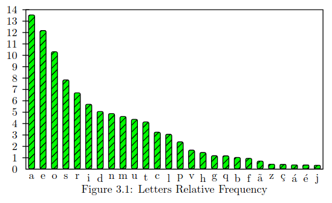
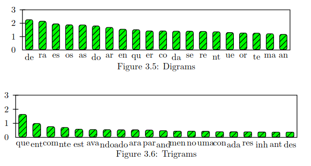

# CTF Week #10 (Classical Encryption)

## Recognition

In this CTF, we are given an excerpt from a portuguese journal, where each letter has been replaced with a special character using a classical encryption method, and no other characters are observed, with the exception of `{` and `}`, which delimit the contents of the flag. Our objective is to find the letter mapping that deciphers the message, in order to retrieve the flag. The ciphered text is as below:

```
(^#+|_#$$>^>=!=+$|,[>,|]>]>#=,#>@=$*^(>,|$@=+=[=!=]#-|!|+-,>*|*|#-=/=,[=-=$|!,|-=+>)^>,->&|#,>>[=->!>=@|!=,,|^@^,>+-|=#-=:=,>$|=$,|$^*->@=$$=&=,>]@#[^*(>@=$=+-|]@|/=#$@|^]>,|^+#>=#+|$/|,>@>@=_^,|>^/=*#-#!==^-,=$+=]|$*#(>@=$>]^@>+!>+>(^#+|_#$$>^&#!>,>]->]_|]/|*=!>]#+:==)^||$->>$^$!#->,&=,-|$>/,||+$=|$+=$]|#=$/=*#-#!=$@>!>/#->*(^#+|||+$|$>=|*|$]>+^|*,>]_=-_>,!|*=$]#+#$-,=@>|@^!>!>=|@|*&#]@>$#*[>&#*=$=&=|>+-#(=@#,|!-=,@=*#!|^@|_#$$>^>(,#!^*-=,|$>*(>,[#=$|/,=/,#|->,#=$|./,=/,#>@=$/|*>[#>@=#+&>+-|[#|{:+@)^]][@+.|^+,|}
```

## Finding the Exploit

As suggested in Moodle, since we are dealing with an instance of classical encryption that maps letters to other characters, we need to find the letter mapping (key) and use it to reverse the encryption. 

Since nothing more suggests the opposite, we must treat this encryption as a standard **substitution cipher**, so our best bet is to perform a **frequency letter attack**. As said in Moodle, the original text is from a portuguese journal, so we need the common letter frequency of portuguese text, which we can find in [this report](https://www.mat.uc.pt/~pedro/lectivos/CodigosCriptografia1011/interTIC07pqap.pdf). The most relevant pieces of information are the frequency charts for letters (figure 3.1), digrams (figure 3.5) and trigrams (figure 3.6):

<div align="center" justify="center">
    ​
    
</div>

## Performing the Attack

For the frequency letter attack, the first thing we need is to measure the most frequent letters, bigrams and trigrams in the message. For that, we can use the script provided in the [Secret-Key Encryption Seedlab](https://seedsecuritylabs.org/Labs_20.04/Crypto/Crypto_Encryption/), where we also performed a frequency letter attack.

```py
#!/usr/bin/env python3

from collections import Counter
import re

TOP_K  = 20
N_GRAM = 3

# Generate all the n-grams for value n
def ngrams(n, text):
    for i in range(len(text) -n + 1):
        # Ignore n-grams containing white space
        if not re.search(r'\s', text[i:i+n]):
           yield text[i:i+n]

# Read the data from the ciphertext
with open('L07G01.cph') as f:
    text = f.read()

# Count, sort, and print out the n-grams
for N in range(N_GRAM):
   print("-------------------------------------")
   print("{}-gram (top {}):".format(N+1, TOP_K))
   counts = Counter(ngrams(N+1, text))        # Count
   sorted_counts = counts.most_common(TOP_K)  # Sort 
   for ngram, count in sorted_counts:                  
       print("{}: {}".format(ngram, count))   # Print
```

Executing the script with `python freq.py` yields the following result:

```
-------------------------------------
1-gram (top 20):
>: 61
=: 61
|: 58
#: 42
$: 41
,: 37
^: 26
+: 26
-: 26
@: 25
*: 20
!: 19
]: 19
/: 13
[: 10
(: 9
&: 8
_: 7
): 3
:: 3
-------------------------------------
2-gram (top 20):
=$: 15
,|: 11
|$: 10
>,: 9
@=: 9
=,: 8
>@: 8
,>: 8
->: 8
#+: 7
$>: 7
>]: 7
#-: 7
|*: 7
!>: 7
$|: 6
-=: 6
>+: 6
#$: 5
>=: 5
-------------------------------------
3-gram (top 20):
>@=: 7
@=$: 5
#+|: 4
(^#: 3
^#+: 3
|_#: 3
_#$: 3
#$$: 3
$​$>: 3
$>^: 3
>,|: 3
#>@: 3
,|$: 3
=$|: 3
>!>: 3
>+-: 3
+-|: 3
,>]: 3
=*#: 3
|$>: 3
```

From the frequencies, the most common symbols are, by far, `>`, `=` and `|`, just as `a`, `e` and `o` in the Portuguese alphabet, so we can associate them in some order. We can also see that the trigram `>@=` appears very frequently in the text. The most frequent trigram with the first and last characters being distinct and either `a`, `e` or `o` is `ado`, giving us a strong confidence that `>@=|` maps to `adoe`. In addition, the most popular bigram is `=$`, and the bigrams `es`, `os` and `as` are in the top 5 bigrams of the Portuguese alphabet, and `$` is a very frequent letter, so we can say with good probability that `$` corresponds to `s`.

Since we already found five letters using the most frequent combinations, it is a good idea to back at our original cipher to see more patterns on our text. To test each substitution, we developed a simple Python script, `replace.py`, that read the contents of the file and replaced the given original characters with the given key:

```py
#!/usr/bin/python3

import sys

original = sys.argv[1]
key      = sys.argv[2]

with open('L07G01.cph') as file:
    text = file.read()

for (o, n) in zip(original, key):
    text = text.replace(o, n)
print(text)
```

The script can be executed in the terminal using the command `python3 replace.py <original> <key>`.

The patterns found that lead to a successful decrytion, found after some trial and error, are listed in the table below:


|        Pattern         |                      Before                      |                      After                      |
| :--------------------: | :----------------------------------------------: | :---------------------------------------------: |
|       `*` -> `l`       |                 `...saoe*es...`                  |                 `...saoeles...`                 |
|       `-` -> `t`       |                   `...es-a...`                   |                  `...esta...`                   |
| `,` -> `r`, `^` -> `u` |               `...os,es^ltados...`               |              `...osresultados...`               |
| `_` -> `b`, `#` -> `i` |                 `..._#ssau...` *                 |                 `...bissau...`                  |
| `(` -> `g`, `+` -> `n` |               `...(ui+ebissau...`                |               `...guinebissau...`               |
|       `!` -> `c`       | `...antigodire!tor...` , `...doli!eudebissau...` | `...antigodirector...`, `...doliceudebissau...` |
| `[` -> `v`, `]` -> `m` |          `...aoconser[are]a]aioria...`           |          `...aoconservaremamaioria...`          |
|       `/` -> `p`       |              `...eleito/orvoto...`               |              `...eleitoporvoto...`              |
| `)` -> `q`, `&` -> `f` |              `...na)uarta&eira...`               |              `...naquartafeira...`              |
|       `:` -> `h`       |             `...duranteoito:oras...`             |            `...duranteoitohoras...`             |
|       `.` -> `x`       |               `...e.propriados...`               |              `...expropriados...`               |

\*the expression appears multiple times throughout the text (probably related to the news article itself)

With these substitutions, we end up with what looks like an excerpt from a news article about the elections in the Guinea-Bissau, and some final text about expropriated farmers and land owners.

<pre style="white-space: pre-wrap !important">
guinebissauaoconservaremamaioriadoslugaresdonovocomitecentraleleitoporvotosecretonaquartafeiraavotacaodecorreuduranteoitohoraseosresultadossoforamdivulgadosontemdepoisdeumareuniaoinesperadadobureaupoliticooutrosnomesligadosamudancanaguinebissauficaramtambempelocaminhooqueestaasuscitarfortesapreensoesnosmeiospoliticosdacapitalguineeensesaoelesmanuelrambotbarcelosministrodaeducacaoedelfimdasilvafilosofoeantigodirectordoliceudebissauagricultoresalgarvioseproprietariosexpropriadospelaviadoinfantevie{hndqummvdnxeunre}
</pre>

| Original                | Encrypted                |
| ----------------------- | ------------------------ |
| `abcdefghilmnopqrstuvx` | `>_!@\|&(:#*]+=/),$-^[.` |

After submitting the flag, with the text between the curly brackets, we confirm that our decrytion was successful and we finally finish the CTF!
