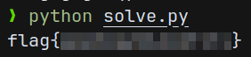

# CTF Week #12 (RSA)

In this CTF, we want to decrypt a message encrypted using RSA encryption, exploring how the internal mechanisms of the algorithm work and how we can reverse engineer them to break the encryption.

## Analysis

Along with this CTF, we we're provided with the encrypted message and part of the encryption script. The encrypted message is as follows:

```
Public exponent: 65537
Modulus: 24707306311927565716857342128774085333197833223161879682238935306082805123046306993647507776054336486228891340858985829027076261887914242781617846672453431405057802571897736937823738849140751058109921340461535802287668907675976045568213671498458065941287381647966844659912124488281609529126696536683530771726875507606589
b2370a40bf9d42078c2a9816171d57044d1b5e79687f51875692cdca764bc877dd3a63752d8563664a20664d6b805f546971435742b41349c53315287e2f931a5b0a489d75bba86767535044834050a085de928406802ec79d904f6e1b581395adbf6fa579af1d2fc86d3f3d1fcaab5c0268d956e05cc56cc35e7ebd326585a3eda479d007000000000000000000000000000000000000000000000000000000000000000000000000000000000000000000000000000000000000000000000000000000000000000000000000000000000000000000000000000000000000000000000000000000000000000000000000000000000000000000000000000000
```

The first line contains the public exponent, the second line the modulus and the third line the cryptogram (in hexadecimal).

In addition to this, we were also given the encryption script, `gen_example.py`, which has the following source code:

```py
def getParams(i, j):
    p = getRandomPrime(i)
    q = getRandomPrime(j)
    n = p*q
    phi = (p-1) * (q-1)
    e = 0x10001 
    d = extendedEuclidean(e, phi) 
    return (p, q, n, phi, e, d)

def enc(x, e, n):
    int_x = int.from_bytes(x, "little")
    y = pow(int_x,e,n)
    return y.to_bytes(256, 'little')

def addFlag(s, f):
	return s+"flag{"+f+"}"

def genFlag():
	return "".join([string.ascii_lowercase[random.randint(0,25)] for _ in range(16)])

def gen():
	f = open("LEICXGY.cph", "w")
	fl = genFlag()
	m = addFlag("", fl)

	(p, q, n, phi, e, d) = getParams(500+offset, 500+offset+1)
	c = enc(m.encode(), e, n)

	f.write("Public exponent: "+str(e)+"\n")
	f.write("Modulus: "+str(n)+"\n")
	f.write(hexlify(c).decode())
	f.close()
```

The script defines the functions:

- `getParams()` - Returns the parameters used in the encryption (p, q, n, phi, e and d), given (what is presumably) the exponents for the primes generation
- `enc()` - Encrypts a message `x` using the public exponent `e` and the modulus `n`
- `addFlag()` - Wraps the given string `f` with `flag{...}` and prepends the string `s` to it
- `genFlag()` - Generates a random 16-character string
- `gen()` - Generates the encrypted message and writes it to a file, along with the public exponent and modulus

The function `extendedEuclidean()` is also used in the RSA algorithm to calculate `d`, the modular multiplicative inverse of `e` modulo `phi = (p - 1) * (q - 1)`. 

To fully break the encrytion, we would need the definition of `getRandomPrime()`, which is not provided. However, from the description of the CTF, we know that the primes `p` and `q` are primes close to `2^(500+offset)` and `2^(500+offset+1)` respectively, where `offset = ((t - 1) * 10 + g) // 2` (with `t` and `g` being our class turn and group number, in our case `t = 7` and `g = 1`, meaning `offset = 61`). With this information, we can try to decrypt the message using all primes in a range around these numbers.

## Task 1 - Primality Testing

Since the RSA encryption is closely related to prime numbers, and since the challenge gives approximate values for the primes `p` and `q` used in the encryption, the first step is to discover the primes themselves. A good way to approach this is to develop a primality testing algorithm/heuristic. The suggestion for this task is the Miller-Rabin algorithm. 

The [Miller-Rabin primality test](https://en.wikipedia.org/wiki/Miller%E2%80%93Rabin_primality_test) is a probabilistic primality test that determines whether a given number is prime or not. If the test discards the number, it cannot be prime. Hovewer, if the test passes, the number is likely to be prime, up to a certain probability.

An implementation of the Miller-Rabin algorithm is provided below:

```py
import random

def miller_rabin(n, k=25):
    if n < 2:
        return False
    if n == 2:
        return True
    
    s, d = 0, n - 1
    while d % 2 == 0:
        s += 1
        d //= 2
        
    for _ in range(k):
        a = random.randint(2, n - 1)
        x = pow(a, d, n)
        
        for _ in range(s):
            y = pow(x, 2, n)
            if y == 1 and x not in [1, n - 1]:
                return False
            x = y
        
        if x != 1:
            return False
    return True
```

From there, we can test all the primes in the vicinity of the given values for `p` and `q` and test them against the encrypted message.

```py
OFFSET = 10000  # Purely arbitrary value

def gen_primes(t, g, n):
    p_guess = 2 ** (500 + ((t-1)*10 + g) // 2)
    
    primes = [(x, n // x) for x in range(p_guess - OFFSET, p_guess + OFFSET) if miller_rabin(x) and n % x == 0]
    return primes
```

## Task 2 - Modular Multiplicative Inverse

To decrypt the message, we need to calculate the value of `d` using the public exponent `e` and the modulus `n`. The private key `d` is the [modular multiplicative inverse](https://en.wikipedia.org/wiki/Modular_multiplicative_inverse) of `e` modulo `phi = (p - 1) * (q - 1)`, which can be calculated using the [Extended Euclidean Algorithm](https://en.wikipedia.org/wiki/Extended_Euclidean_algorithm).

In short, the modular multiplicative inverse of an integer `a` is an integer `x` such that `ax = 1 (mod m)`. While the Euclidean Algorithm calculates the greatest common divisor of two numbers, the Extended Euclidean Algorithm also calculates the coefficients of the Bézout's identity, i.e. it finds `x` and `y` such that `ax + by = gcd(a, b)`. For `a` to have a modular multiplicative inverse modulo `m`, then `a` and `m` must be coprime, i.e. `gcd(a, m) = 1`. So, the previous equation becomes `ax + my = 1`, which means that `x` is the modular multiplicative inverse of `a` modulo `m`.

This strategy can be seen in the following implementation:

```py
def extended_euclidean(a, b):
    if b == 0:
        return a, 1, 0
    else:
        gcd, x1, y1 = extended_euclidean(b, a % b)
        x = y1
        y = x1 - (a // b) * y1
        return gcd, x, y

def modular_inverse(e, phi_n):
    gcd, x, _ = extended_euclidean(e, phi_n)
    if gcd != 1:
        return None
    else:
        return x % phi_n
```

## Task 3 - Decrypting the Message

With the previous functions, we can estimate the values of `p` and `q` based on `e` and `n` and, with them, calculate the value of `d`. which allow us to decrypt the message.

Since we need to test multiple possible values for `p` and `q`, we can iterate over all possible pairs of primes and decrypt the message using the calculated private key `d`. If the message is decrypted without errors, we can ensure that the message is the one we are looking for (the flag) if it starts with `flag{`.

```py
def load_encrypted_data(file_path):
    with open(file_path, "r") as f:
        lines = f.readlines()
        e = int(lines[0].split(": ")[1])
        n = int(lines[1].split(": ")[1])
        c_hex = lines[2].strip()
        ciphertext = bytes.fromhex(c_hex)
        return e, n, ciphertext

def main():
    file_path = "./LEIC07G01.cph"
    e, n, ciphertext = load_encrypted_data(file_path)
    
    t = 7
    g = 1
    for p, q in gen_primes(t, g, n):
        phi_n = (p - 1) * (q - 1)
        d = modular_inverse(e, phi_n)
        if d is None:
            continue
        
        plaintext = decrypt(ciphertext, d, n).decode(errors='ignore')
        if plaintext.startswith("flag{"):
            print(plaintext)
            break
```

After running the script and waiting a few seconds, we successfully decrypted the message and obtained the flag!

<p align="center" justify="center">
  
</p>

## Q&A

To reiterate some of the key points we talked about in this CTF:

- How can I use the information I have to infer the values used in the RSA that cyphered the message?

  As done in the script, since we know approximately the values of `p` and `q` used in the encryption, we can test all the primes in the vicinity of these values, with the help of the Miller-Rabin test, and test them against the encrypted message. We can assume that the values that give the correct decryption are the correct values.

- How can I discover if my inference is correct?

  By decrypting the message using the calculated values of `p` and `q` and checking if the decrypted message starts with `flag{`.

- Finally, how can I extract my key from the cryptogram I received?

  As mentioned previously, we can use trial-and-error to find the correct values of `p` and `q` and, with them, we can calculate the private key `d` using the modular multiplicative inverse, based on the Extended Euclidean Algorithm.
