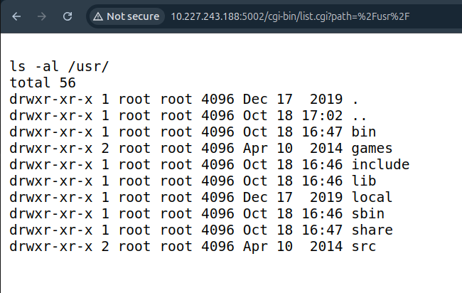
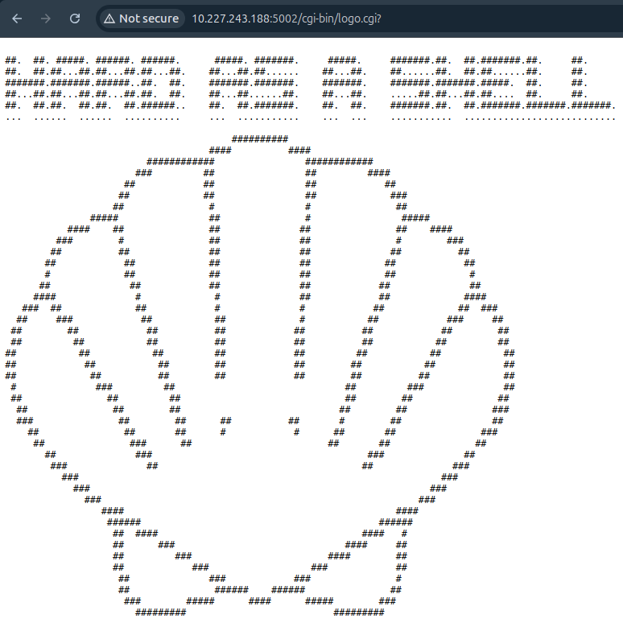
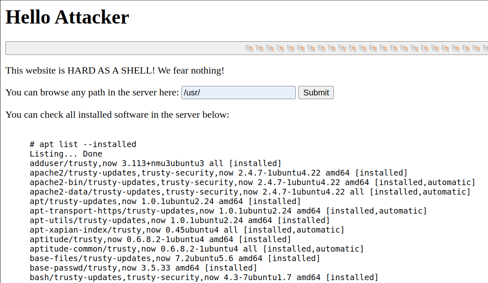
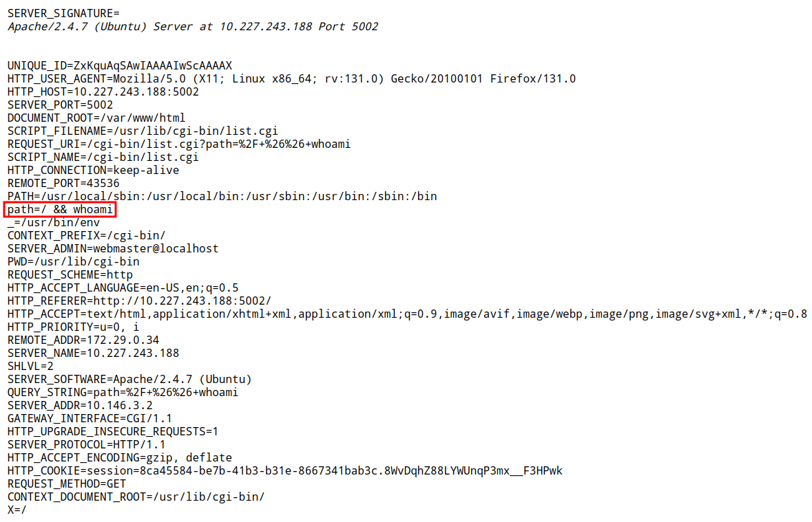
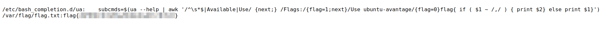

# CTF Week #4 (Environment Variables)

## Recognition

In this CTF, we had access to a webpage (http://10.227.243.188:5002/), titled "Super Hardened Website". In this page, the user can allegedly browse any path in the server through a search query. By submitting a filepath, the website redirects to the page that only has the output of executing `ls -al` with the filepath specified.

<p align="center" justify="center">
  
</p>

There are also two buttons, one at the top and one on the bottom of the main page, containing a sequence of shell emojis. When clicked, a new page appears, only containing the text "HARD AS A SHELL" and a clam shape in ASCII art.

<p align="center" justify="center">
  
</p>

Other than that, the most relevant element is the list of the installed software on the server, allegedly obtained through the command `apt list --installed`.

<p align="center" justify="center">
  
</p>

## CVE Research

The thing that stands out the most on the website is the ability to perform path queries. When one is executed, we can see, through the URL path, that the query action is performed by a CGI script, called `list.cgi`. We can also see that the page "HARD AS A SHELL" is also similar, being the action carried out by a file called `logo.cgi`.

With that information, we proceeded to search "environment variables cgi script" on CVE Mitre, yielding 33 results.

## CVE Selection

Going through the search results, previously mentioned, the ones that stood out the most were CVE-2014-7169, CVE-2014-6278, CVE-2014-6277 and CVE-2014-6271 since they have very similar descriptions, which we later confirmed that it was due to all of them being derived from CVE-2014-6271, because of incomplete fixes.

The vulnerability CVE-2014-6271 mentions that it affects servers running Bash version 4.3 or lower, allowing attackers to execute arbitrary code in a environment set up with vulnerable vectors that run at privilege boundaries, occurring what is known as "**Shellshock**". By looking at the list of installed software in the main page, we see that the server runs indeed Bash version 4.3, corroborating that this vulnerability affects the server.

By submitting the flag `flag{CVE-2014-6271}`, we confirm that this was, in fact, the vulnerability to abuse in this CTF.

## Finding an Exploit

We began by searching for CVE-2014-6271 in [Exploit DB](https://www.exploit-db.com/) and conducting a Google search for "CVE-2014-6271 exploit." This yielded numerous verified exploits on Exploit DB and several GitHub repositories containing Python code designed to perform the exploit. 

Additionally, we researched the ShellShock vulnerability on [Wikipedia](https://en.wikipedia.org/wiki/Shellshock_(software_bug)) to gain a deeper understanding of the bug's background and impact. With this information, we proceeded to analyze the available exploit code in detail.

During our investigation, we found a basic test command on Wikipedia that could be used to check for the vulnerability:

```bash
env x='() { :;}; echo vulnerable' bash -c "echo this is a test"
```

According to Wikipedia, this exploit works because Bash incorrectly executes commands that follow a function when imported.

Now, we needed to know how to insert this vulnerable command. The only input field we have on the website is the path query. Our first idea was to inject some partial Bash command inside it, e.g. `/ && whoami`, in the hopes that it would be executed as `ls / && whoami` if the server is executing `ls <input>`. Although this did not seem to work, we verified that all the path variables were outputted, a similar result as running `env` on the server. Among those, we verified the string `path=/ && whoami`, showing us that the user input is indeed being stored as an environment variable.

<p align="center" justify="center">
  
</p>


## Exploiting the Vulnerability

Given the test command, and considering that the path query is stored in the environment variable `path`, we inserted the query `'() { :;}; grep -R "flag{" /'` on the path input. We replaced the command `echo vulnerable` with `grep -R "flag{" /`, which searches the string `"flag{"` on all the server's files. For the same reason, the command needs a few minutes to finish.

After some time, we received the result, which includes the flag and concludes the CTF!

<p align="center" justify="center">
  
</p>

## Vulnerability Remediation

Since this vulnerability was caused by bad parsing performed in old versions of Bash, as explained in the previous sections, the most trivial solution is to update the Bash package to a recent version (4.4 or higher). Other mitigations can be applied in rare cases, where the server packages cannot be upgraded, such as configuring `mod_security` rules to reject HTTP requests with data that may be interpreted by Bash as a function definition or by enforcing Bash to use privileged mode (https://access.redhat.com/articles/1212303).

