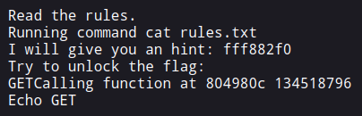
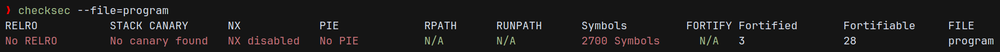
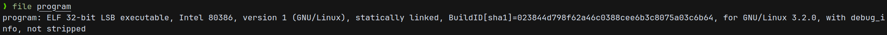
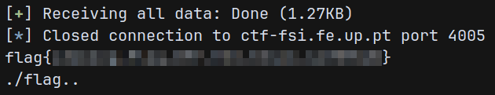

# CTF Week #6 (Format Strings)

## Recognition

In this CTF, we have two resources that we need to analyze.

The first is a web page. After opening it, we get the following message:

<p align="center" justify="center">
    
</p>

The second is a zip file that is included in the CTF description. Extracting this archive reveals its contents: 
 - an executable `program`
 - the source code file `main.c`
 - two text files `rules.txt` and `flag.txt`
 - a python script named `exploit-template.py`, which constitutes a template for sending a payload to the program. This script imports the `pwn` module, which means that it uses the [pwntools library](https://docs.pwntools.com/en/stable/), a CTF framework commonly used to create exploit scripts.

If we execute the program, we see also an output very similar to the one we saw on the website. This suggests that the web server we need to exploit also uses the same executable, and also has a `rules.txt` files, because it prints its contents, and a `flag.txt` (by association). The `flag.txt` that was provided on the zip only contains a dummy flag, so we predict that the file in the server contains the real flag, and we must find a way to exploit the program into printing its contents.

## Finding an Exploit

The first thing we'll do to analyze the program is running `checksec` on it, to check all of its security protections.

<p align="center" justify="center">
    
</p>

As we see, the executable does not present stack canaries (`No canary found`), the stack is executable (`NX disabled`) and its addresses are not randomized (`No PIE`). This broadens our possibilities of attacks. For example, since the stack is executable, we could inject shellcode using a buffer overflow, which also benefits from non-randomized locations in memory.

**NOTE:** The version of `checksum` does not present the binary architecture, which will be relevant for the exploit later on. To determine this, we can use the command `file`, which prints details about a file.

<p align="center" justify="center">
    
</p>

From this, we conclude this is a 32-bit executable.

Having seen this, we proceed to reading the program's source-code. We can observe the declaration of two functions: `readtxt`, which reads the contents of a text file using the `cat` command inside a call to `system`, with a filename (without `.txt` extension) up to 6 characters in length, and `echo`, which prints the given string. The main function seems to use both functions by assigning their addresses to a function pointer called `fun`.  
The flow of the program is the following:
  1. Reads the rules, calling `readtxt` with `rules.txt`.
  2. Gives a "hint", which is the address of the `fun` variable (not the address of the function it points to)
  3. Reads the input of the user and prints it using `printf`
  4. Makes an additional call to `echo` with the user input, also printing the address of the called function (`echo`) in both hexadecimal and decimal format.

One way to print the contents of `flag.txt` is to overwrite the value of `fun` to point to `readtxt` instead of `echo`. Our first idea was to apply a similar exploit we used on the previous CTF, using a stack buffer overflow. However, this program does not suffer from this vulnerability, since it stores the user input in a buffer with 100 characters and only reads 99 (even terminating the buffer with a null character).

Upon further inspection, we see that, on the `printf` call, instead of printing the contents of `buffer` safely (using `printf("%s", buffer)`), it uses `buffer` as a format string (`printf(buffer)`).  
This means that the program suffers from a **Format String vulnerability**, and suggests that we do our desired action (change `fun`) by using a malicious input that will be interpreted as a format string.

## Exploiting the Vulnerability

Now, we need to build a payload that will force `printf` to write `&readtxt` to `fun`.

Therefore, we need two values:
  - the address of `fun`, which is printed by the executable before entering the input.
  - the address of `readtxt`. Since the executable is not PIE, the address is always fixed, so we can determine it in `gdb`. By loading the program, we even find the program was compiled with debug information, so we can just get the value of `fun` before executing line 26, which is `0x80497a5`.

Then, we need to build the format string. Since this can be a challenging task for bigger strings, we were recommended (in Moodle) to use the [fmtstr](https://docs.pwntools.com/en/stable/fmtstr.html) module of pwntools.

Analyzing the documentation, we see that the function that does what we ought to do is `fmtstr_payload`. Some relevant arguments of this function are `offset`, with the first offset of the formatter, `writes`, with a dictionary that maps addresses to write to to the wanted values, and `numbwritten`, with the number of character already written by the function.

Since we also want to pass `"flag"` to the call to `*fun`, we need a way to reuse the payload for both purposes, to be used as an argument of `readtxt` and as a malicious format string. Since `readtxt` truncates the argument string to 6 characters, we can prefix the format string with `"./flag"`.

With all these considerations, we modified the exploit script template to have the following:

```py
res = r.recvuntil(b"flag:\n")
print(res)

hint = res.decode('utf-8').split("hint: ")[1].split("\n")[0].strip()

hex_value = int(hint, 16)
print(f"Extracted hint: {hex_value}")

value = 0x080497a5
writes = {
    hex_value: value,
}
prefix = b"./flag.."
numbwritten = len(prefix)
offset = numbwritten // 4 + 1
payload = prefix + fmtstr_payload(offset, writes, numbwritten=numbwritten)
print(f"Payload: ", payload)

r.sendline(payload)
```

The script will:

  1. Read the address of `fun` and parse it.
  2. Build the format string, considering the important values and that it will be preceded by the prefix `"./flag.."`, which must be taken in consideration in the calculation of `numbwritten` and `offset`. The extra dots we're added to ensure the number of characters before the format string is a multiple of 4, reducing the problems we face when determining `offset`.
  3. Send the payload (prefix + format string)

With this, we can execute with `python exploit-template.py`, that executes the exploit on the local executable, and it effectively prints the dummy flag. To apply it on the remote server, we change the line `r = process('./program')` to `r = process('ctf-fsi.fe.up.pt', <port>)`. After executing, we successfully obtain the flag!

<p align="center" justify="center">
  
</p>