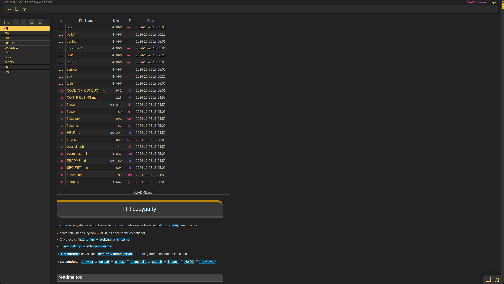
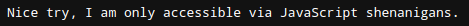
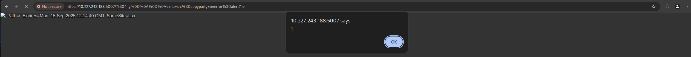
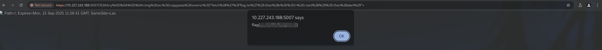

# CTF Week #7 (Cross Site Scripting - XSS)

## Recognition

In this CTF, we have been given an URL link (http://10.227.243.188:5007/) to a webpage, which hosts a Web file sharing service. This page also exhibits the contents of the README.md in the first page, showing that the service is based on [copyparty](https://github.com/9001/copyparty).

<p align="center" justify="center">
     <!-- Image from the website -->
</p>

In this web page, we observed that there is a file named `flag.txt`, which presumably contain the flag. However, if we try to open it, we only receive the message "Nice try, I am only accessible via JavaScript shenanigans."

<p align="center" justify="center">
     <!-- Message from JavaScript -->
</p>

Although there are more things on this page that can be explored, not much is relevant for exploiting it.

## CVE Research

The first thing we did to find an exploit is to find documented vulnerabilities associated with copyparty. By going to its [GitHub repository](https://github.com/9001/copyparty), and going to the "Security" tab, we saw three vulnerabilities that affected older versions of the service.

We also observed that the most recently patched vulnerability has the code [CVE-2023-38501](https://nvd.nist.gov/vuln/detail/CVE-2023-38501) and the name ["Reflected cross-site scripting via k304 parameter"](https://github.com/9001/copyparty/security/advisories/GHSA-f54q-j679-p9hh) . According to its description, affected applications are susceptible to cross site scripting via the URL parameter `k304` or `setck`, which "could allow an attacker to execute malicious javascript code by tricking users into accessing a malicious link".

To verify if a service is affected, a proof-of-concept (PoC) URL is provided:

```
https://localhost:3923/?k304=y%0D%0A%0D%0A%3Cimg+src%3Dcopyparty+onerror%3Dalert(1)%3E
```

This url contains inside `k304` an HTML element ``, properly URL-encoded, where `src` is an invalid link and `onerror` has the malicious JavaScript code to be executed. In the PoC, since the `src`' URL is invalid, it will execute the `onerror` code `alert(1)`, which creates a prompt with the text "1". By modifying the host and accessing the resulting URL, `https://10.227.243.188:5007/?k304=y%0D%0A%0D%0A%3Cimg+src%3Dcopyparty+onerror%3Dalert(1)%3E`, we confirmed that the prompt indeed appears, indicating that the site is vulnerable to XSS attacks using this method.

<p align="center" justify="center">
     <!-- Example proof of concept -->
</p>

## Finding an Exploit

Since accessing the file `flag.txt` points "I am only accessible via JavaScript shenanigans", our idea was to fetch the content of the flag file by performing a request through JavaScript. For this, we can use the [Fetch API](https://developer.mozilla.org/en-US/docs/Web/API/Fetch_API), through the function `fetch`, to make a GET request to the website endpoint that matches the file.

## Exploiting the Vulnerability

To build the exploit URL, we removed the URL encoded `img` element from the PoC URL (to get `https://localhost:3923/?k304=y%0D%0A%0D%0A`), and created our own `img` element with the same `src` and, on error, will perform a GET request to the path `/flag.txt`.

```html
 r.text()).then(alert)">
```

Then, we URL encoded this element using [this website](https://www.urlencoder.org/) and appended to the previous base URL to get:

```
https://10.227.243.188:5007/?k304=y%0D%0A%0D%0A%3Cimg%20src%3Dcopypasta%20onerror%3D%22fetch%28%27%2Fflag.txt%27%29.then%28r%20%3D%3E%20r.text%28%29%29.then%28alert%29%22%3E
```

Accessing this URL effectively opened the website and launches an alert with the flag!

<p align="center" justify="center">
     <!-- Flag image blurred -->
</p>

## XSS Characterization

In this CTF, as previously mentioned in the vulnerability description, we managed to obtain the flag using a Reflected XSS exploit.  
This type of attack happens when the attacker uses requests (in this case, the URL with the extra parameter) to attack a legitimate website. This malicious payload is then "reflected" to execute on the client (in this case, showing the hidden flag through the HTML element).
