# Seedlab Week #11 (Public Key Infrastructure - PKI)

# Part 1: SeedLab Tasks

### Initial Setup

Before starting this SeedLab, there is a simple initial setup consisting of the following steps:
- Launch the docker container for this seedlabs (which can be done with the `dcbuild` and `dcup` commands)
- Add the necessary entries in the /etc/hosts file, mapping the container's IP address

<p align="center" justify="center">
    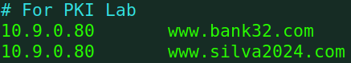
</p>

In this case, we added these two entries. The first one is necessary in order to follow the example of the SeedLab. The second one corresponds to the custom name we will use throughout the rest of the tasks.

## Task 1: Becoming a Certificate Authority (CA)

For this task, we will create a root Certificate Authority (self-signed) and use it to issue certificates for others (in this case, our "randomwebsite").

To become a root Certificate Authority, we will use OpenSSL with a different configurations. The default configuration file is located in `/usr/lib/ssl/openssl.cnf`. The first thing to do is to copy this configuration to a new directory (this way we can change it without consequences, and use it for the rest of the commands):
```sh
cp /usr/lib/ssl/openssl.cnf .
```

After obtaining this configuration file, we will change it and create some necessary directories and files, based on the `[ CA_default ]` section of the file. The section of the file is the following:

```
[ CA_default ]
dir             =   ./demoCA        # Where everything is kept
certs           =   $dir/certs      # Where the issued certs are kept
crl_dir         =   $dir/crl        # Where the issued crl are kept
database        =   $dir/index.txt  # database index file.
unique_subject  =   no              # Set to ’no’ to allow creation of
                                    # several certs with same subject.
new_certs_dir   =   $dir/newcerts   # default place for new certs.
serial          =   $dir/serial     # The current serial number
```
And to create the initial setup we need to execute the following commands (starting from the same directory as the configuration file):
```sh
mkdir ./demoCA
cd demoCA
mkdir certs
mkdir crl
mkdir newcerts
touch index.txt
echo "1000" > serial
```

We also need to uncomment the `unique_subject` line shown previously, to allow creation of certifications with the same subject.

After this OpenSSL setup, we are ready to become a CA. We can cd back into the `openssl.cnf` directory and all we need to do is run the following command:
```sh
openssl req -x509 -newkey rsa:4096 -sha256 -days 3650 \
-keyout ca.key -out ca.crt \
-subj "/CN=www.modelCA.com/O=Model CA LTD./C=US" \
-passout pass:dees
```
This command should create two files:
- `ca.key` which contains the information needed to create pairs of public and private keys. This file can be analyzed with `openssl rsa -in ca.key -text -noout`.
- `ca.crt`, the certificate that associates the public key to the modelCA entity. This file can be analyzed with `openssl x509 -in ca.crt -text -noout`.

### Questions:

#### What part of the certificate indicates this is a CA’s certificate?

By analyzing the contents of the `ca.crt` file, we can see that this certificate is a CA's certificate because it contains the value `CA:TRUE` in the `X509v3 extensions`.

<p align="center" justify="center">
    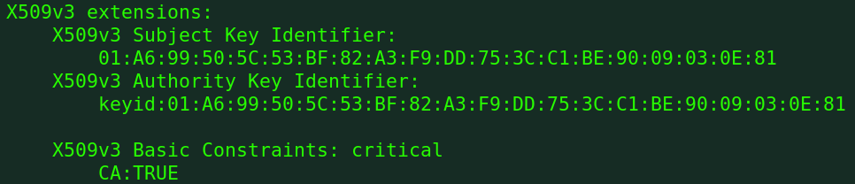
</p>

#### What part of the certificate indicates this is a self-signed certificate?

Once agian, By analyzing the contents of the `ca.crt` file, we can see that this certificate is self-signed not only because the `Issuer` and `Subject` are the same, but also since the `Subject Key Identifier` is the same as the `Authority Key Identifier`.

<p align="center" justify="center">
    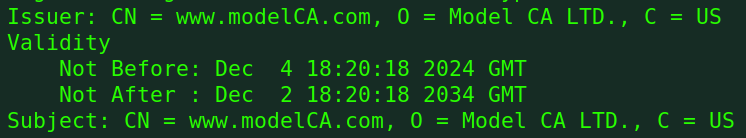
    
</p>

#### In the RSA algorithm, we have a public exponent e, a private exponent d, a modulus n, and two secret numbers p and q, such that n = pq. Please identify the values for these elements in your certificate and key files.

| Field                | Key `ca.key`      | Certificate `ca.crt` |
| -------------------- | ----------------- | -------------------- |
| Public Exponent (e)  | `publicExponent`  | `Exponent`           |
| Private Exponent (d) | `privateExponent` |                      |
| Modulus (n)          | `modulus`         | `Modulus`            |
| p                    | `prime1`          |                      |
| q                    | `prime2`          |                      |

Screenshots of these values from the file output are also shown below:
<p align="center" justify="center">
    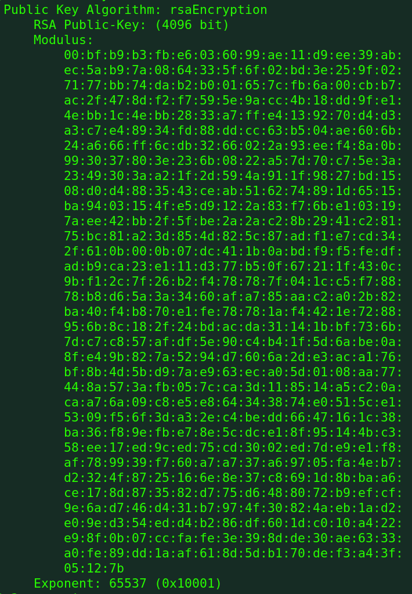
    Values shown in the `ca.crt` file
</p>

<p align="center" justify="center">
    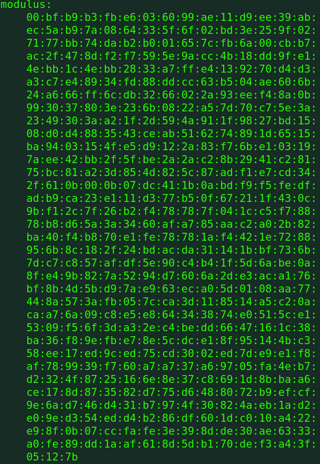
    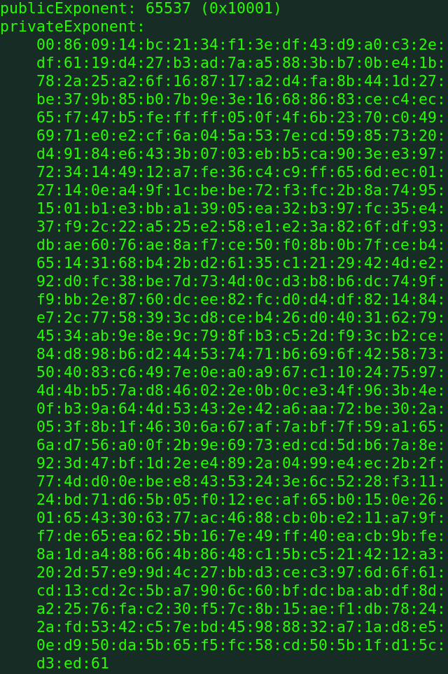
    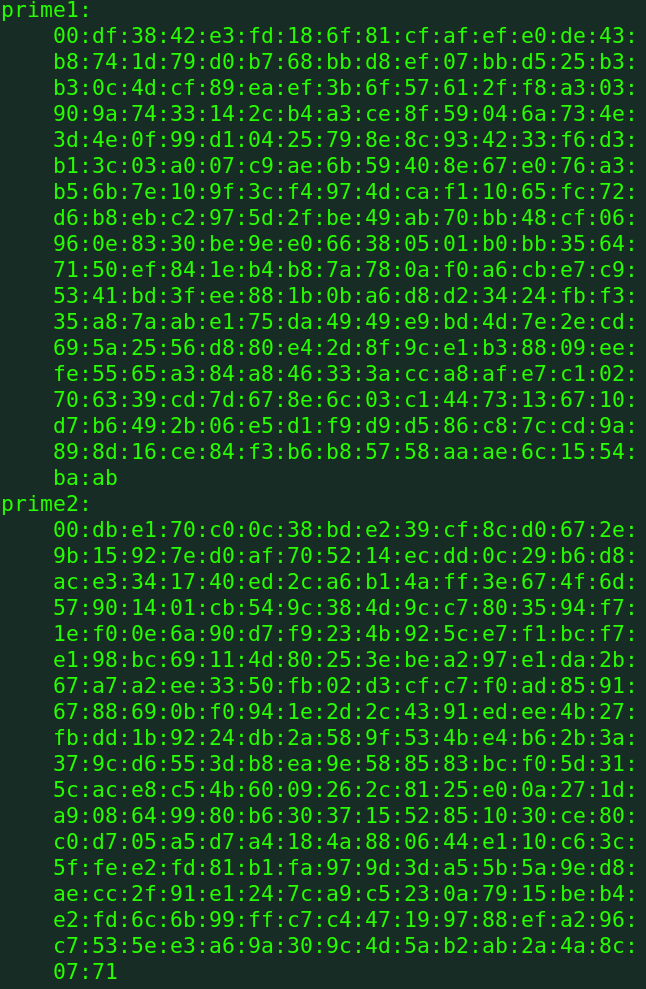
    Values shown in the `ca.key` file
</p>

## Task 2: Generating a Certificate Request for Your Web Server

After becoming a Certificate Authority (CA), we will use this to create a public key certificate for our own webserver (www.randomwebsite.com). 

The first step is to generate the Certificate Signing Request (CSR), which can be done with the following command:
```bash
openssl req -newkey rsa:2048 -sha256 \
    -keyout server.key -out server.csr \
    -subj "/CN=www.randomwebsite.com/O=randomwebsite Inc./C=US" \
    -passout pass:dees
```
This command should create two files:
- `server.key` file (with a similar structure and purpose as the `ca.key`). This file can be analyzed with `openssl rsa -in server.key -text -noout`.
- `server.csr` (the certificate signing request with the public key). This file can be analyzed with `openssl req -in server.csr -text -noout`.
  
As solicited by the guide, we should also add two alternative names to the CSR, for this, we can run a command similar to the previous one:
```bash
openssl req -newkey rsa:2048 -sha256 \
    -keyout server.key -out server.csr \
    -subj "/CN=www.randomwebsite.com/O=randomwebsite Inc./C=US" \
    -passout pass:dees
    -addext "subjectAltName = DNS:www.randomwebsite.com, \
                              DNS:www.randomwebsite1.com, \
                              DNS:www.randomwebsite2.com"
```
<p align="center" justify="center">
    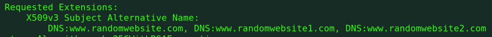
</p>

## Task 3: Generating a Certificate for your server

After generating a Certificate Signing Request, the Certificate Authority needs to sign it to form the Certificate that can be used by the other entity. In this lab, we will do this process ourselves and generate `server.crt` using `server.csr`, `ca.key` and `ca.crt`.

But first, we need to uncomment the `copy_extensions` line in the `openssl.cnf`:
```
# Extension copying option: use with caution.
copy_extensions = copy
```

Finally, we can generate the certificate for `www.randomwebsite.com` with the following command:
```bash
openssl ca -config myCA_openssl.cnf -policy policy_anything \
    -md sha256 -days 3650 \
    -in server.csr -out server.crt -batch \
    -cert ca.crt -keyfile ca.key
```
<p align="center" justify="center">
    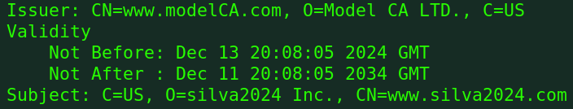
</p>

## Task 4: Deploying Certificate in an Apache-Based HTTPS Website

Now that we have create a Certificate from our Certificate Authority for our web server (`www.randomwebsite.com`), we can deploy our HTTPS website with it, using Apache. The guide for this lab already create an instante for the `bank32` example, but it also explains how the process to replicate the same using a different website.

The first step is to obtain shell access to the container, which can be done using the `docksh` alias.  
After that, we can go to the `/etc/apache2/sites-available` and create a configuration for our website, similar to the one in the `bank32_apache_ssl.conf`.
The final configuration for our website is shown below:
<p align="center" justify="center">
    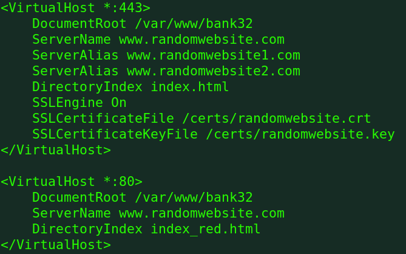
</p>

We named this configuration `random_website.conf`. Please note the changes to `ServerName`, `SSLCertificateFile` and `SSLCertificateKeyFile`. We kept the `DocumentRoot` the same as the example (screenshots shown below).

After creating the Apache configuration, we need to add the adequate certificate and key to the `certs` directory, which can be done using the following commands (from outside the container):
```sh
docker cp server.key <CONTAINER-ID>:/certs/randomwebsite.key
docker cp server.crt <CONTAINER-ID>:/certs/randomwebsite.crt
```

Finally, we can launch our web server with:
```sh
a2enmod ssl            # Enable the SSL module
a2ensite randomwebsite # Enable the site described in the file
service apache2 start  # Start the server
```

When acessing `http://www.randomwebsite.com` we will get the following screen which shows that the web server is now running as intended.
<p align="center" justify="center">
    
</p>

However, the setup we made should allow us to access the webserver through `https://www.randomwebsite.com`.
<p align="center" justify="center">
    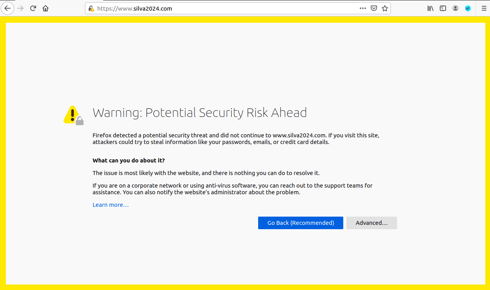
</p>

However, when we access the server, we see a `potential security risk ahead` message. This is because, although the web server has certificate, the Certificate Authority is not recognized by the browser. 

To fix this, we just need to go to `about:preferences#privacy` > `View Certificates` > `Import` and select our `ca.crt` file. We should then see a new entry on the Certificate Manager for ModelCA.
<p align="center" justify="center">
    
    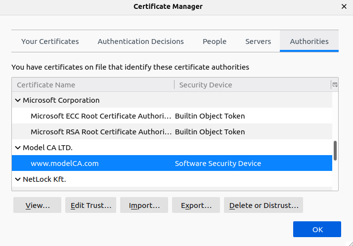
</p>

Now, when we access the `https://www.randomwebsite.com`, we will be greeted with the green `Hello World` message.

<p align="center" justify="center">
    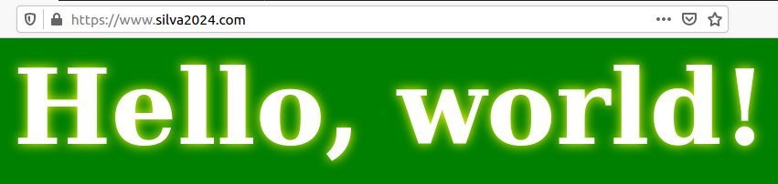
</p>


## Task 5: Launching a Man-In-The-Middle Attack

## Task 6: Launching a Man-In-The-Middle Attack with a Compromised CA

# Part 2: Compromised Certifica Authorities

<!-- 
TODO: 
    confirmar o tema na aula teórica:
- supostamente é Certificate Revocation List
- atacante pode tentar evitar o uso de CRLs
-->
