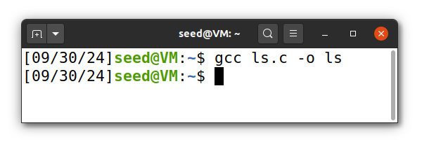

# Environment Variable and Set-UID
<!-- 
## Task 1

* `printenv` or `env` show all Env. Veriables
* `printenv PWD` or `env | grep PWD` prints PWD variable
* `export PWD=/home/seed` / `unset PWD` - sets or unset variable PWD

## Task 2

* `env` variables are equal for parent process and for child process when use `fork()` function.

## Task 3

### Task 3.1

```c
execve("/usr/bin/env", argv, environ);  
```

* returns `NULL`

```c
int execve(const char *filename, char *const argv[], char *const envp[]);

extern char **environ;  # Env Veriables are not passed as a argument. 
```

### Task 3.2

```c
execve("/usr/bin/env", argv, environ);  
```

Env. Veriable are printed.

### Task 3.3

The Env Veriables must be explicetly passed.

---

Brief explanation:

* `fork()` is used to create a new process, which is a **copy of the calling** (parent) process.
* `execve()` is used to **replace the current process** with a new program.

---

## Task 4

The `system()` executes `/bin/sh -c command`. It use `execl()` to use `/bin/sh` calls `execve` passing env.var. array.

```c
# prints all env.vars.

#include <stdio.h>
#include <stdlib.h>
int main()
{   
    system("/usr/bin/env");
    return 0 ;
}
```

## Task 5

The `Set-UID` programms gain owner’s privilege (e.g. if program's owner is `root`, when anyone runs this program, the program gains the root’s privileges during its execution).

```c
#include <stdio.h>
#include <stdlib.h>

extern char **environ;

int main()
{
    int i = 0;
    while (environ[i] != NULL) {
        printf("%s\n", environ[i]);
        i++;
    }
}
```

Compile and add set ownership to `root` and make it `Set-UID` programm.

```bash
sudo chown root foo
sudo chmod 4755 foo
```

```bash
[09/29/24]seed@VM:~/.../Labsetup$ printenv PATH
/usr/local/sbin:/usr/local/bin:/usr/sbin:/usr/bin:/sbin:/bin:/usr/games:/usr/local/games:/snap/bin:.:.
[09/29/24]seed@VM:~/.../Labsetup$ printenv LD_LIBRARY_PATH
[09/29/24]seed@VM:~/.../Labsetup$
[09/29/24]seed@VM:~/.../Labsetup$ export FEUP=leic
[09/29/24]seed@VM:~/.../Labsetup$ printenv FEUP
leic
```

```bash
[09/29/24]seed@VM:~/.../Labsetup$ foo | grep PATH
WINDOWPATH=2
PATH=/usr/local/sbin:/usr/local/bin:/usr/sbin:/usr/bin:/sbin:/bin:/usr/games:/usr/local/games:/snap/bin:.:.
[09/29/24]seed@VM:~/.../Labsetup$ foo | grep FEUP
FEUP=leic
[09/29/24]seed@VM:~/.../Labsetup$ foo | grep LD_LIBRARY_PATH
[09/29/24]seed@VM:~/.../Labsetup$   # isso e estranho
``` -->

## Questão 1 - Task 6: The PATH Environment Variable and Set-UID Programs

First, create a malicious program named `ls.c` in a directory (e.g., `/home/seed`). 

```c
#include <stdio.h>
#include <stdlib.h>

int main()
{
    printf("Malicious code is executing...\n");
    system("whoami");
}
```
Compile the `ls.c` program using the following command:

<p align="center" justify="center">
  
</p>

> * The idea here is to create a fake `ls` program that does something different from the actual `/bin/ls` command.
> * So we can replace a legitimate system programm with malicious code.

Next, create a new program that calls the system’s `ls` command, as in guid:

```c
#include <stdlib.h>

int main()
{
    system("ls");
    return 0;
}
```
> Program calls the `system()` function to execute the `ls` command, but it doesn't specify the absolute path (`/bin/ls`), the system will search for ls using the directories listed in the `PATH`

* Compile this program using the command: `gcc myls.c -o myls`
* Change the owner of the myls program to root and set it as a Set-UID program with the following commands: `sudo chown root myls`, `sudo chmod 4755 myls`.
> By using `chown` and `chmod 4755`, we can make the `myls` program a Set-UID program owned by root. This means that when a normal user execute this program, it will run with root privileges — potentially leading to a *privilege escalation*.
* Add the directory `/home/seed` to your `PATH` environment variable to ensure the system executes your malicious `ls` program instead of the standard `ls`: `export PATH=/home/seed:$PATH`
> As `system()` function runs `/bin/sh -c "<command>"` it inherits all environment variables from the calling process, including `PATH`.
* To prevent shell countermeasures when executing a Set-UID program, run the following command (provided by guid): `sudo ln -sf /bin/zsh /bin/sh`.

<p align="center" justify="center">
  
</p>

Now, we can test `myls` program by executing:

<p align="center" justify="center">
  
</p>

> The output show `root`, indicating that your malicious program has escalated privileges and is running as root.

To revert the changes run: `sudo ln -sf /bin/dash /bin/sh` and `export PATH=${PATH#/home/seed:}`.

<p align="center" justify="center">
  
</p>


<!-- ## Task 7

### Task 7.1
`mylib.c`:
```c
#include <stdio.h>
void sleep (int s)
{
  printf("I am not sleeping!\n");
}
```
```bash
gcc -fPIC -g -c mylib.c                       # Compile mylib.c into an object file.
gcc -shared -o libmylib.so.1.0.1 mylib.o -lc  # Link the object file into a shared library
export LD_PRELOAD=./libmylib.so.1.0.1
```

* `-shared`: Tells the compiler to produce a shared object (dynamic library).
* `-o libmylib.so.1.0.1`: Specifies the output file, which is the shared library named libmylib.so.1.0.1.
* `mylib.o`: This is the object file from the previous step.
* `-lc`: Links against the C standard library (libc). The -l flag tells the compiler to link with a library, and c specifies libc.
* `export LD_PRELOAD=./libmylib.so.1.0.1`: This tells the system to load libmylib.so.1.0.1 before any other libraries when running a program.

### Task 7.2

* normal user: 
```bash
[09/30/24]seed@VM:~/.../code$ myprog
I am not sleeping!
```
* normal user, but Set-UID:
```bash
[09/30/24]seed@VM:~/.../code$ myprog    # sleep 1 second
[09/30/24]seed@VM:~/.../code$
```
> because a normal user cannot override standard library functions in a Set-UID program.

* as root:
```bash
[09/30/24]seed@VM:~/.../code$ sudo su
root@VM:/home/seed/Desktop/week_4/Labsetup/code# export LD_PRELOAD=./libmylib.so.1.0.1
root@VM:/home/seed/Desktop/week_4/Labsetup/code# ./myprog 
I am not sleeping!
root@VM:/home/seed/Desktop/week_4/Labsetup/code# 
```
* user1 case:
system ignores the LD_PRELOAD, so it sleep 1 second. -->

## Questão 2 - Task 8.1: Invoking External Programs Using `system()` versus `execve()`

First, we need to compile the program and set it as a root-owned Set-UID executable.

<p align="center" justify="center">
  
</p>

Next, we create the `adminfile`, which is readable, writable, and executable only by `root`:

<p align="center" justify="center">
  
</p>

> As discussed in Task 6, the command `sudo ln -sf /bin/zsh /bin/sh` is necessary to acquire elevated privileges when executing as the `seed` user.

We can now test the `catall` program:

<p align="center" justify="center">
  
</p>

```c
v[0] = "/bin/cat"; v[1] = argv[1]; v[2] = NULL;

command = malloc(strlen(v[0]) + strlen(v[1]) + 2);
sprintf(command, "%s %s", v[0], v[1]);
```

From the source code, we can observe that the program concatenates `/bin/cat` with the provided input string. This allows an attacker to inject additional commands using `&&.`

<p align="center" justify="center">
  
</p>

> After the concatenation `sprintf(command, "%s %s", v[0], v[1]);`, the resulting command is `/bin/cat adminfile && rm -rf adminfile`. The system executes `cat`, followed by `rm`, with root privileges. As shown, the adminfile was successfully deleted.