# Seedlab Week #4 (Environment Variable and Set-UID)

## Question 1

### Task 1: Manipulating Environment Variables

This task consisted on learning some simple commands for manipulating environment variables:

- The environment variables of a shell can be printed using `printenv` or `env`.
- To find a specific variable, we can use either `printenv <VAR>` or `env | grep <VAR>` (note that the second one can be used to find more complex expressions).
- The command `export` sets an environment variable, while `unset` can be used to unset it.

<p align="center" justify="center">
  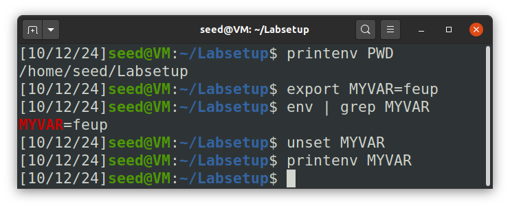
</p>

### Task 2: Passing Environment Variables from Parent Process to Child Process

In this task, we learned more about the creation of child processes in the Unix operating systems (through the `fork()` system call) and how the environment variables are passed from the parent process to the child process.

The `fork()` system call is used to create a child process, which is an almost identical copy of the parent process. We can check if the current process is the child or the process by checking the return value of `fork()`. 

With this task, we verified that the two processes resulting from a **fork** will **share the same environment variables**.

<p align="center" justify="center">
  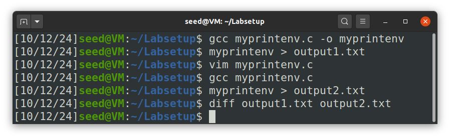
</p>

### Task 3: Environment Variables and `execve()`

This task focused on the `execve()` system call. This function overwrites all the process data and code with the loaded program's, effectively replacing a process with a new one. To call this function, we give the executable path, the command-line arguments and a third parameter (the environment variables). 

In this task, we experimented passing `NULL` and `environ` as the third argument. In the first case, there was no output, since there were no environment variables in the "new" process, but in the second case, the environment variables we're printed. 

This gives us the conclusion that the third argument of `execve()` specifies the environment variables of the new process, which can be confirmed by seeing the manual pages of `execve` and `environ` (`man execve environ`).

We used the value `environ` for the last parameter because in a Unix system, when we define an `extern char** environ` at the start of the program, it will contain all the environment variables. By passing this value to the `execve` call, we are keeping all of them in the new loaded program.

<p align="center" justify="center">
  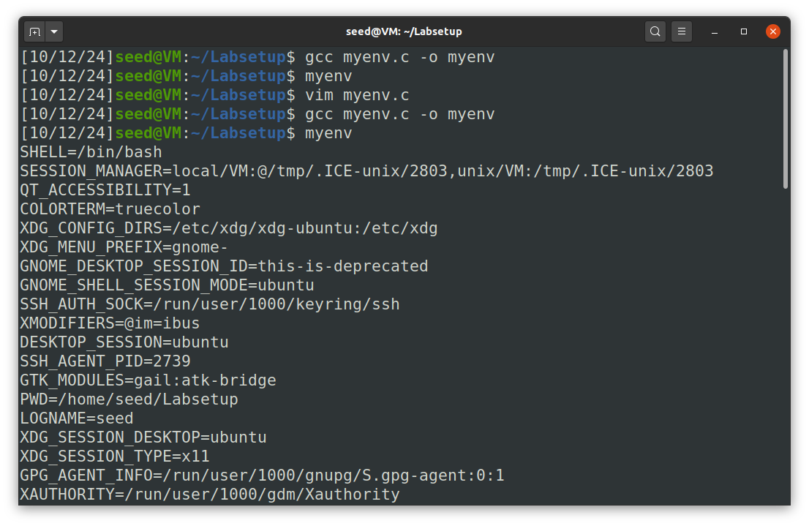
</p>

### Task 4: Environment Variables and `system()`

This task centered around `system()` function, which executes a command in a new shell (`/bin/sh`). In addition, all the environment variables of the calling process are passed to the shell process, which is verified on compiling and running the code given in this task (place in `mysystem.c` in our case).

What happens underneath is that the `system()` call will actually run `/bin/sh -c command`, effectively keeping all of the environment variables in the command that will be executed.

<p align="center" justify="center">
  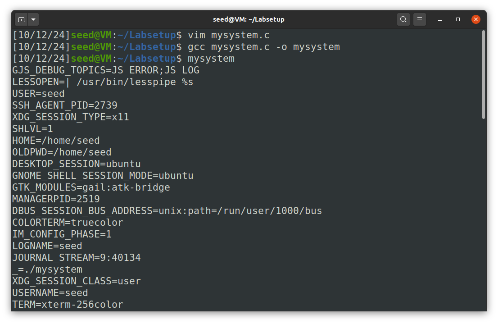
</p>

### Task 5: Environment Variable and Set-UID Programs

This task's aim was the creation and usage of Set-UID programs.

A Set-UID program assumes the owner privileges when executed, which allows the escalation of the user's privileges. Although the behavior of the program is set by its code, it can be affected using environment variables, which makes Set-UID programs susceptible to attacks.

In this task, we first copied the program's code inside a C file (`set-uid.c`), compiled and converted it into a root Set-UID executable (using `chown root` and `chmod 4755`) and verified that some environment variables are exported to the process. 

We tried modifying the variables `PATH`, `LD_LIBRARY_PATH` and `TEST` (the latter being created by us) and we found out that any alterations to `PATH` and `TEST` are passed to the `set-uid.c` program, but `LD_LIBRARY_PATH` is not. 

<p align="center" justify="center">
  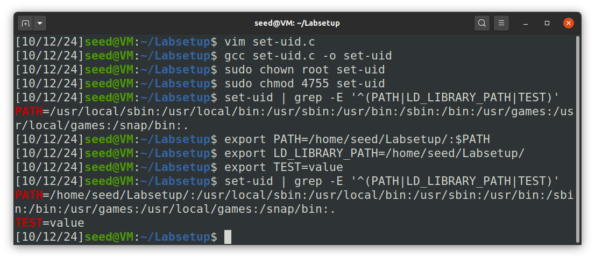
</p>

After searching for a while, we found out that this is due to a security mechanism of the [dynamic linker](https://man7.org/linux/man-pages/man8/ld.so.8.html) called secure-execution mode, which is triggered on (not only) Set-UID programs, that ignores certain changes to environment variables related to the dynamic linker operation.

### Task 6: The PATH Environment Variable and Set-UID Programs

The goal of this task is to explore how the PATH environment variable can be used to change the execution of Set-UID programs. 

Let's start by creating a new program that calls the system’s `ls` command, as asked in the guide:
```c
#include <stdlib.h>

int main()
{
    system("ls");
    return 0;
}
```
> Program calls the `system()` function to execute the `ls` command, but it doesn't specify the absolute path (`/bin/ls`)  
> The system will search for ls using the directories listed in the `PATH`, in order

Then, we compile this program using the command: `gcc myls.c -o myls`, and we change the owner of the myls program to root and set it as a Set-UID program with the following commands: `sudo chown root myls` and `sudo chmod 4755 myls`.

> By using `chown` and `chmod 4755`, we can make the `myls` program a Set-UID program owned by root. This means that when a normal user execute this program, it will run with root privileges — potentially leading to a *privilege escalation*.

After this, we can create a malicious program named `ls.c` in a directory (e.g., `/home/seed`). 

```c
#include <stdio.h>
#include <stdlib.h>

int main()
{
    printf("Malicious code is executing...\n");
    system("whoami");
}
```
> The idea here is to create a fake `ls` program that does something different from the actual `/bin/ls` command.
> This way we can replace a legitimate system programm with malicious code.

Then, we compile the `ls.c` program using the following command: `gcc ls.c -o ls`.

After compiling our custom ls command, we add the directory `/home/seed` to the `PATH` environment variable to ensure the system executes your malicious `ls` program instead of the standard `ls`: `export PATH=/home/seed:$PATH`
> As `system()` function runs `/bin/sh -c "<command>"` it inherits all environment variables from the calling process, including `PATH`.  
> **Note**: To prevent shell countermeasures when executing a Set-UID program, run the following command (provided by the guide): `sudo ln -sf /bin/zsh /bin/sh`.

<p align="center" justify="center">
  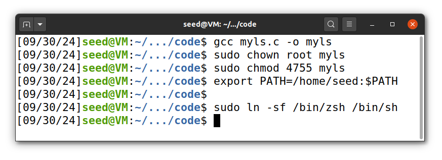
</p>

Finally, we can test `myls` program by executing `myls`

<p align="center" justify="center">
  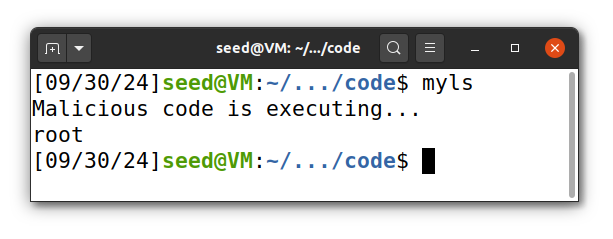
</p>

> The output show `root`, indicating that your malicious program has escalated privileges and is running as root.  
> This means that we were able to execute commands as root, giving us access to everything on the system.

After doing this exploit, to revert the changes run: `sudo ln -sf /bin/dash /bin/sh` and `export PATH=${PATH#/home/seed:}`.

<p align="center" justify="center">
  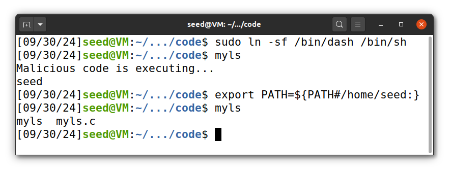
</p>

## Question 2

### Task 8.1: Invoking External Programs Using `system()`

The goal of this task is exploit the privilege escalation of a Set-UID file that uses the `system()` call to execute commands.

First, we need to compile the program given and set it as a root-owned Set-UID executable.

```c
#include <unistd.h>
#include <stdio.h>
#include <stdlib.h>
#include <string.h>

int main(int argc, char *argv[])
{
  char *v[3];
  char *command;

  if(argc < 2) {
    printf("Please type a file name.\n");
    return 1;
  }

  v[0] = "/bin/cat"; v[1] = argv[1]; v[2] = NULL;

  command = malloc(strlen(v[0]) + strlen(v[1]) + 2);
  sprintf(command, "%s %s", v[0], v[1]);

  // Use only one of the followings.
  system(command);
  //execve(v[0], v, NULL);

  return 0 ;
}
```

<p align="center" justify="center">
  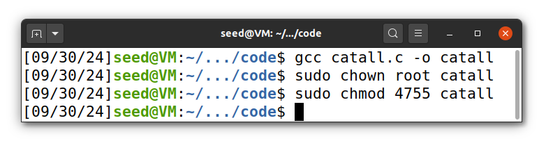
</p>

Next, in order to test this exploit, let's create the `adminfile`, which is readable, writable, and executable only by `root`:

<p align="center" justify="center">
  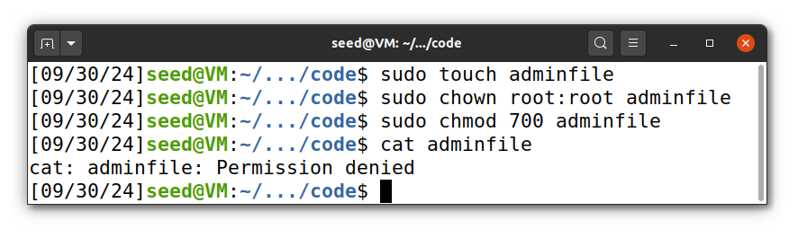
</p>

> As discussed in Task 6, the command `sudo ln -sf /bin/zsh /bin/sh` is necessary to acquire elevated privileges when executing as the `seed` user.

We can now test the `catall` program, and ensure that it is able to `cat` the contents of the file as intended, while the normal `cat` command cannot.

<p align="center" justify="center">
  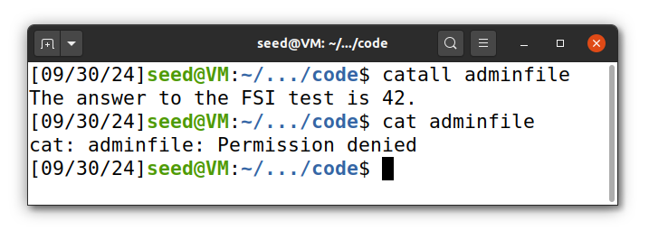
</p>

However, by analyzing the source code, we can observe that the program concatenates `/bin/cat` with the provided input string (ideally a file or path), without perform any validation on the command-line argument. But since we are running the system call, this allows an attacker to inject additional commands using `&&` or `;`, followed by additional commands.

```c
v[0] = "/bin/cat"; v[1] = argv[1]; v[2] = NULL;

command = malloc(strlen(v[0]) + strlen(v[1]) + 2);
sprintf(command, "%s %s", v[0], v[1]);
```

<p align="center" justify="center">
  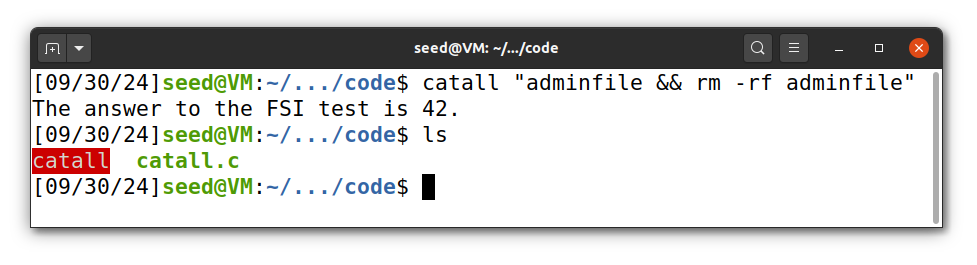
</p>

> After the concatenation `sprintf(command, "%s %s", v[0], v[1]);`, the resulting command is `/bin/cat adminfile && rm -rf adminfile`.  
> The system executes `cat`, followed by `rm`, with root privileges. As shown, the adminfile was successfully deleted.

### Task 8.2: Invoking External Programs Using `execve()`

This task, uses the same principle of the previous one (8.1) but instead of using `system()` in the `catall` file, we will use `execve()`:

```c
#include <unistd.h>
#include <stdio.h>
#include <stdlib.h>
#include <string.h>

int main(int argc, char *argv[])
{
  char *v[3];
  char *command;

  if(argc < 2) {
    printf("Please type a file name.\n");
    return 1;
  }

  v[0] = "/bin/cat"; v[1] = argv[1]; v[2] = NULL;

  command = malloc(strlen(v[0]) + strlen(v[1]) + 2);
  sprintf(command, "%s %s", v[0], v[1]);

  // Use only one of the followings.
  //system(command);
  execve(v[0], v, NULL);

  return 0 ;
}
```

Once again, we will compile and make this file a Set-UID, as well as check ensure the correct shell is called, to allow for privilege escalation.

<p align="center" justify="center">
  
</p>

This time, when we try to apply the same logic as the one before, we will not be able to execute a second command. This is due to the parameters that are passed to the `execve` call.

Instead of running the entire string, `execve` receives a first argument specifying which binary should be executed and only then a second argument with the arguments which is passed as an array of strings.

This means that when running `./catall "adminfile && rm -rf adminfile"` will call the function `/bin/cat "adminfile && rm -rf adminfile"`. This will return an error saying that there was no file found with that name.

<p align="center" justify="center">
  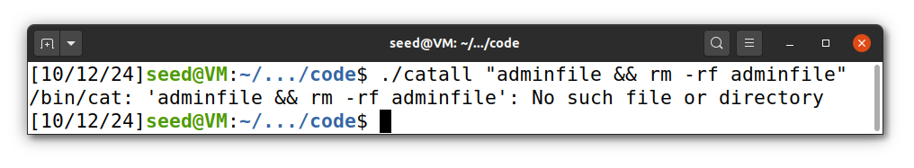
</p>

From this, we can conclude that the `execve` is not vulnerable to the same exploit as the `system` call, making the `catall` more secure.