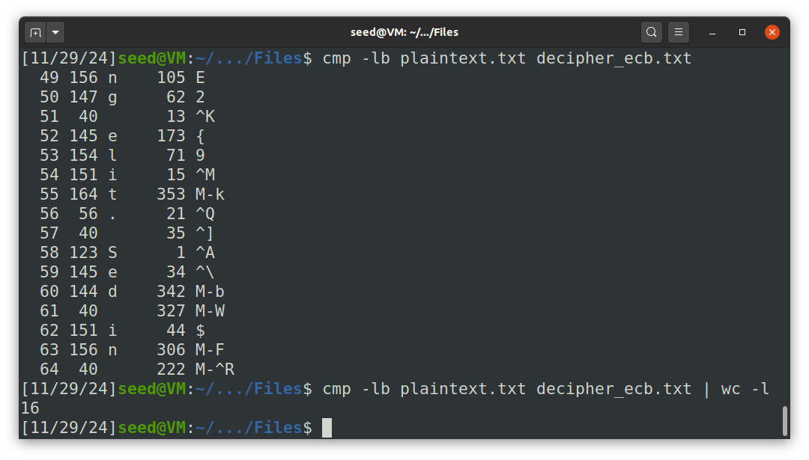
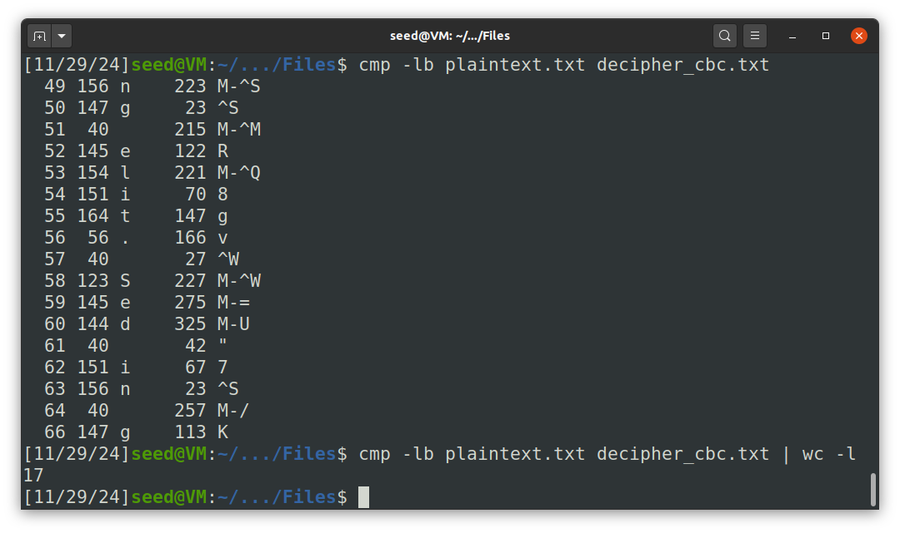
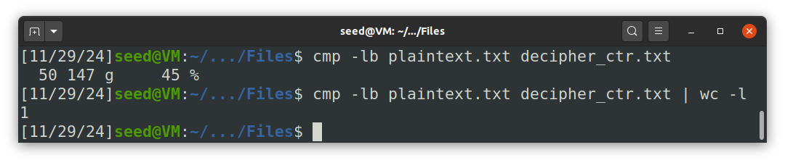

# Seedlab Week #9 (Secret Key Encryption)

# Task 1: Frequency Analysis

For this first task, the objective is to decypher the contents of the `ciphertext.txt` file. This file contains an English message that was encrypted using a monoalphabetic substitution cipher, where each letter of the original text is mapped to a different letter in the encrypted text (for example, every `a` is replaced with `j`, every `b` is replaced with `f`, and so on). In order for it to decrypted, it is also implicit that each letter can only correspond to a single letter (otherwise, if for example `a` and `b` were both replaced by `m` we wouldn't be able to revert the substitution).

In order to decypher the text, the recommended approach is to analyze the frequencies of single letters, bigrams (two consecutive letters) and trigrams (three consecutive letters). Since we know the original text is English, we can analyze the common frequencies of each of those and try letter by letter to convert the text. To help with this, we use the `tr` command in the following manner: `tr <encrypted-characters> <original-characters> < ciphertext.txt > message.txt`.

By running the `freq.py` script, we will get output of the absolute frequencies of letters, bigrams and trigrams. We can see the typical cryptanalytic frequency of each of those in the wikipedia links of the task description:
- [Single Characters](https://en.wikipedia.org/wiki/Frequency_analysis)
- [Bigrams](https://en.wikipedia.org/wiki/Bigram)
- [Trigrams](https://en.wikipedia.org/wiki/Trigram)

A good start is the most common trigram `ytn` whose frequency is far higher than all the other trigrams and contains two of the most frequent characters `y` and `n` with a mildly common letter in between `t`. This trigram should correspond to `the`, so the first attempt was `tr "ytn" "THE" < ciphertext.txt > message.txt`.

From now on, we just kept using frequency analysis and reading the output of the `message.txt` to see if we could decrypt any words contextually, until we got the full 26-character mapping. Below are the sequence of steps we followed:

| Cipher | Original | Justification                              |
| :----: | :------: | ------------------------------------------ |
|  `v`   |   `A`    | Frequency analysis and the `vT` and `THvT` |
|  `x`   |   `O`    | Frequency analysis and the `Tx`            |
|  `i`   |   `L`    | Frequency analysis and the `Aii`           |
|  `h`   |   `R`    | Frequency analysis and the `Oh` `AhE`      |
|  `q`   |   `S`    | Frequency analysis and the `THOqE`         |
|  `b`   |   `F`    | Frequency analysis and the `ALL Ob THOSE`  |
|  `m`   |   `I`    | Frequency analysis and the `HmSTORmaAL`    |
|  `a`   |   `C`    | Frequency analysis and the `HISTORIaAL`    |
|  `g`   |   `B`    | Frequency analysis and the `gEST`          |
|  `p`   |   `D`    | Frequency analysis and the `pIRECTOR`      |
|  `l`   |   `W`    | Frequency analysis and the `AlARDS`        |
|  `u`   |   `N`    | Frequency analysis and the `AnD`           |
|  `r`   |   `G`    | Frequency analysis and the `EARNINr`       |
|  `c`   |   `M`    | Frequency analysis and the `NOcINATIONS`   |
|  `z`   |   `U`    | Frequency analysis and the `WITHOzT`       |
|  `e`   |   `P`    | Frequency analysis and the `eICTURE`       |
|  `d`   |   `Y`    | Frequency analysis and the `TERRIBLd`      |
|  `f`   |   `V`    | Frequency analysis and the `ACTIfISM`      |
|  `s`   |   `K`    | Frequency analysis and the `LIsE`          |
|  `o`   |   `J`    | Frequency analysis and the `oUST`          |
|  `j`   |   `Q`    | Frequency analysis and the `jUESTION`      |
|  `k`   |   `X`    | Frequency analysis and the `EkTRA`         |
|  `w`   |   `Z`    | Frequency analysis and the `PRIwE`         |

By adding on to the `tr` command we should end up with something similar to this:

```sh
tr "ytnvxihqbmagplurczedfsojkw" "THEAOLRSFICBDWNGMUPYVKJQXZ" < ciphertext.txt > message.txt
```

The final mapping of characters between the original and encrypted message is shown below:

|          Original          |         Encrypted          |
| :------------------------: | :------------------------: |
| ABCDEFGHIJKLMNOPQRSTUVWXYZ | VGAPNBRTMOSICUXEJHQYZFLKDW |
| CFMYPVBRLQXWIEJDSGKHNAZOTU | ABCDEFGHIJKLMNOPQRSTUVWXYZ |

The final message after decrypting the monoalphabetic substitution cypher is:

```
THE OSCARS TURN  ON SUNDAY WHICH SEEMS ABOUT RIGHT AFTER THIS LONG STRANGE
AWARDS TRIP THE BAGGER FEELS LIKE A NONAGENARIAN TOO

THE AWARDS RACE WAS BOOKENDED BY THE DEMISE OF HARVEY WEINSTEIN AT ITS OUTSET
AND THE APPARENT IMPLOSION OF HIS FILM COMPANY AT THE END AND IT WAS SHAPED BY
THE EMERGENCE OF METOO TIMES UP BLACKGOWN POLITICS ARMCANDY ACTIVISM AND
A NATIONAL CONVERSATION AS BRIEF AND MAD AS A FEVER DREAM ABOUT WHETHER THERE
OUGHT TO BE A PRESIDENT WINFREY THE SEASON DIDNT JUST SEEM EXTRA LONG IT WAS
EXTRA LONG BECAUSE THE OSCARS WERE MOVED TO THE FIRST WEEKEND IN MARCH TO
AVOID CONFLICTING WITH THE CLOSING CEREMONY OF THE WINTER OLYMPICS THANKS
PYEONGCHANG

ONE BIG QUESTION SURROUNDING THIS YEARS ACADEMY AWARDS IS HOW OR IF THE
CEREMONY WILL ADDRESS METOO ESPECIALLY AFTER THE GOLDEN GLOBES WHICH BECAME
A JUBILANT COMINGOUT PARTY FOR TIMES UP THE MOVEMENT SPEARHEADED BY 
POWERFUL HOLLYWOOD WOMEN WHO HELPED RAISE MILLIONS OF DOLLARS TO FIGHT SEXUAL
HARASSMENT AROUND THE COUNTRY

SIGNALING THEIR SUPPORT GOLDEN GLOBES ATTENDEES SWATHED THEMSELVES IN BLACK
SPORTED LAPEL PINS AND SOUNDED OFF ABOUT SEXIST POWER IMBALANCES FROM THE RED
CARPET AND THE STAGE ON THE AIR E WAS CALLED OUT ABOUT PAY INEQUITY AFTER
ITS FORMER ANCHOR CATT SADLER QUIT ONCE SHE LEARNED THAT SHE WAS MAKING FAR
LESS THAN A MALE COHOST AND DURING THE CEREMONY NATALIE PORTMAN TOOK A BLUNT
AND SATISFYING DIG AT THE ALLMALE ROSTER OF NOMINATED DIRECTORS HOW COULD
THAT BE TOPPED

AS IT TURNS OUT AT LEAST IN TERMS OF THE OSCARS IT PROBABLY WONT BE

WOMEN INVOLVED IN TIMES UP SAID THAT ALTHOUGH THE GLOBES SIGNIFIED THE
INITIATIVES LAUNCH THEY NEVER INTENDED IT TO BE JUST AN AWARDS SEASON
CAMPAIGN OR ONE THAT BECAME ASSOCIATED ONLY WITH REDCARPET ACTIONS INSTEAD
A SPOKESWOMAN SAID THE GROUP IS WORKING BEHIND CLOSED DOORS AND HAS SINCE
AMASSED  MILLION FOR ITS LEGAL DEFENSE FUND WHICH AFTER THE GLOBES WAS
FLOODED WITH THOUSANDS OF DONATIONS OF  OR LESS FROM PEOPLE IN SOME 
COUNTRIES


NO CALL TO WEAR BLACK GOWNS WENT OUT IN ADVANCE OF THE OSCARS THOUGH THE
MOVEMENT WILL ALMOST CERTAINLY BE REFERENCED BEFORE AND DURING THE CEREMONY 
ESPECIALLY SINCE VOCAL METOO SUPPORTERS LIKE ASHLEY JUDD LAURA DERN AND
NICOLE KIDMAN ARE SCHEDULED PRESENTERS

ANOTHER FEATURE OF THIS SEASON NO ONE REALLY KNOWS WHO IS GOING TO WIN BEST
PICTURE ARGUABLY THIS HAPPENS A LOT OF THE TIME INARGUABLY THE NAILBITER
NARRATIVE ONLY SERVES THE AWARDS HYPE MACHINE BUT OFTEN THE PEOPLE FORECASTING
THE RACE SOCALLED OSCAROLOGISTS CAN MAKE ONLY EDUCATED GUESSES

THE WAY THE ACADEMY TABULATES THE BIG WINNER DOESNT HELP IN EVERY OTHER
CATEGORY THE NOMINEE WITH THE MOST VOTES WINS BUT IN THE BEST PICTURE
CATEGORY VOTERS ARE ASKED TO LIST THEIR TOP MOVIES IN PREFERENTIAL ORDER IF A
MOVIE GETS MORE THAN  PERCENT OF THE FIRSTPLACE VOTES IT WINS WHEN NO
MOVIE MANAGES THAT THE ONE WITH THE FEWEST FIRSTPLACE VOTES IS ELIMINATED AND
ITS VOTES ARE REDISTRIBUTED TO THE MOVIES THAT GARNERED THE ELIMINATED BALLOTS
SECONDPLACE VOTES AND THIS CONTINUES UNTIL A WINNER EMERGES

IT IS ALL TERRIBLY CONFUSING BUT APPARENTLY THE CONSENSUS FAVORITE COMES OUT
AHEAD IN THE END THIS MEANS THAT ENDOFSEASON AWARDS CHATTER INVARIABLY
INVOLVES TORTURED SPECULATION ABOUT WHICH FILM WOULD MOST LIKELY BE VOTERS
SECOND OR THIRD FAVORITE AND THEN EQUALLY TORTURED CONCLUSIONS ABOUT WHICH
FILM MIGHT PREVAIL

IN  IT WAS A TOSSUP BETWEEN BOYHOOD AND THE EVENTUAL WINNER BIRDMAN
IN  WITH LOTS OF EXPERTS BETTING ON THE REVENANT OR THE BIG SHORT THE
PRIZE WENT TO SPOTLIGHT LAST YEAR NEARLY ALL THE FORECASTERS DECLARED LA
LA LAND THE PRESUMPTIVE WINNER AND FOR TWO AND A HALF MINUTES THEY WERE
CORRECT BEFORE AN ENVELOPE SNAFU WAS REVEALED AND THE RIGHTFUL WINNER
MOONLIGHT WAS CROWNED

THIS YEAR AWARDS WATCHERS ARE UNEQUALLY DIVIDED BETWEEN THREE BILLBOARDS
OUTSIDE EBBING MISSOURI THE FAVORITE AND THE SHAPE OF WATER WHICH IS
THE BAGGERS PREDICTION WITH A FEW FORECASTING A HAIL MARY WIN FOR GET OUT

BUT ALL OF THOSE FILMS HAVE HISTORICAL OSCARVOTING PATTERNS AGAINST THEM THE
SHAPE OF WATER HAS  NOMINATIONS MORE THAN ANY OTHER FILM AND WAS ALSO
NAMED THE YEARS BEST BY THE PRODUCERS AND DIRECTORS GUILDS YET IT WAS NOT
NOMINATED FOR A SCREEN ACTORS GUILD AWARD FOR BEST ENSEMBLE AND NO FILM HAS
WON BEST PICTURE WITHOUT PREVIOUSLY LANDING AT LEAST THE ACTORS NOMINATION
SINCE BRAVEHEART IN  THIS YEAR THE BEST ENSEMBLE SAG ENDED UP GOING TO
THREE BILLBOARDS WHICH IS SIGNIFICANT BECAUSE ACTORS MAKE UP THE ACADEMYS
LARGEST BRANCH THAT FILM WHILE DIVISIVE ALSO WON THE BEST DRAMA GOLDEN GLOBE
AND THE BAFTA BUT ITS FILMMAKER MARTIN MCDONAGH WAS NOT NOMINATED FOR BEST
DIRECTOR AND APART FROM ARGO MOVIES THAT LAND BEST PICTURE WITHOUT ALSO
EARNING BEST DIRECTOR NOMINATIONS ARE FEW AND FAR BETWEEN
```

> Note: After completing this task, we used the website [dcode.fr](https://www.dcode.fr/en) to validate the substitution  
> This website contains a lot of useful tools (many of them related to ciphers) including [this one](https://www.dcode.fr/monoalphabetic-substitution) to solve monoalphabetic substitution in different languages (including English) and with different variations and parameters

# Task 2

In this task, we applied the `aes-128-ecb`, `aes-128-cbc`, and `aes-128-ctr` algorithms to encode and decode plaintext using the `openssl enc` command.

First, we generated the `plaintext.txt` file. For this, we used a Lorem Ipsum text with 1005 bytes:

```
Lorem ipsum dolor sit amet, consectetur adipiscing elit. Sed in egestas tellus. Fusce vel elit erat. In tellus tellus, iaculis bibendum blandit et, volutpat quis mi. Integer condimentum interdum quam. Ut vitae tellus eu neque pulvinar pellentesque. Curabitur et auctor mauris, gravida lacinia ante. Aliquam aliquet augue ac odio suscipit varius. Aliquam finibus nisi eu mi fermentum tempor nec sit amet ex. Quisque bibendum ut tortor eget volutpat.

Aenean fermentum mattis fermentum. Vestibulum ante ipsum primis in faucibus orci luctus et ultrices posuere cubilia curae; In faucibus non nibh non convallis. Etiam efficitur varius nisl, vitae elementum nisi rutrum aliquet. Aliquam pellentesque lobortis nulla nec commodo. Suspendisse potenti. Sed varius vitae leo ornare ornare. Etiam ac eleifend arcu, eget dignissim augue.

Mauris sed posuere est, ut vulputate elit. Duis luctus hendrerit ornare. Suspendisse tincidunt, libero id ultrices interdum, arcu urna iaculis eros, porttitor semper augue est. 
```

## aes-128-ecb

We started by encrypting the file using the `aes-128-ecb` algorithm. To do this, we used the following flags:
* `-aes-128-ecb`: Specifies the algorithm;
* `-e`: Indicates encryption;
* `-in`: Specifies the input file;
* `-out`: Specifies the output file;
* `-K`: Specifies the key;

> **Note**: ECB mode does not require an Initialization Vector (IV), so the `-iv` flag is not needed.

The encryption command is as follows:
```bash
openssl enc -aes-128-ecb -e -in plaintext.txt -out cipher_ecb.bin -K 00112233445566778889aabbccddeeff
```

To decrypt the file, we change `-e` to `-d` and adjust the input/output files:
```bash
openssl enc -aes-128-ecb -d -in cipher_ecb.bin -out decipher_ecb.txt -K 00112233445566778889aabbccddeeff
```

We can run `diff plaintext.txt decipher_ecb.txt` to verify that the files are identical.

**Characteristics**: 
- ECB encrypts each block independently.
- If the data contains repeating information, the ciphertext would too, because same block of plaintext will result to same ciphertext block, so it not suitable for images.

## aes-128-cbc

Next, we used the `aes-128-cbc` algorithm. The command and flags are similar to those used for ECB, but in this case, we also need to specify the `-iv` flag with the Initialization Vector.

Encryption command:
```bash
openssl enc -aes-128-cbc -e -in plaintext.txt -out cipher_cbc.bin -K 00112233445566778889aabbccddeeff -iv 0102030405060708
```

Decryption command:
```bash
openssl enc -aes-128-cbc -d -in cipher_cbc.bin -out decipher_cbc.txt -K 00112233445566778889aabbccddeeff -iv 0102030405060708
```

**Characteristics**:
- CBC uses the Initialization Vector, and each block is XOR with the previous one ciphertext block (first block XOR with IV). 
- This dependency ensures that repeating plaintext blocks do not result in identical ciphertext blocks, solving the issue seen in ECB.

> **Note**: In both modes, if we try to decrypt the text with the wrong key, `openssl` will be able to tell that a bad decryption occurred

## aes-128-ctr

Finally, we used the `aes-128-ctr` algorithm. 

Encryption command:
```bash
openssl enc -aes-128-ctr -e -in plaintext.txt -out cipher_ctr.bin -K 00112233445566778889aabbccddeeff -iv 0102030405060708
```
Decryption command:
```bash
openssl enc -aes-128-ctr -d -in cipher_ctr.bin -out decipher_ctr.txt -K 00112233445566778889aabbccddeeff -iv 0102030405060708
```

**Characteristics**:
- CTR generates a keystream by encrypting counter value derived from the IV and the key. This keystream is XOR with the plaintext to produce ciphertext, so blocks are processed independently and any data can be accessed eficiently, means that CTR mode can be parallelized, making it faster and more efficient.

> **Note**: Unlike the previous modes, `openssl` is not able to detect the bad encryption if the wrong key is given.

# Task 5

In this task, we analyzed the how much original information is lost when the encrypted message is corrupted, for each one of the three types of encryption.

## aes-128-ebc

For each encrytion mode, the process to verify the amount of information loss is very similar:

1. Encrypt the message.
2. Set the 50th byte to `0x00`, using `bless`.
3. Decrypt the corrupted encrypted message.
4. Determine the bytes that differ between the original and the obtained message, using the `cmp` command.

For example, these are the commands we used for the EBC mode:

```bash
openssl enc -aes-128-ecb -e -in plaintext.txt -out cipher_ecb.bin -K 00112233445566778889aabbccddeeff
bless cipher_ecb.bin  # Modify the 50th byte
openssl enc -aes-128-ecb -d -in cipher_ecb.bin -out decipher_ecb.txt -K 00112233445566778889aabbccddeeff
cmp -lb plaintext.txt decipher_ecb.txt
```

In the aes-128-ecb encrytion, each block of 16 bytes (128 bits) is encryted independently, and so are they decrypted. Therefore, by modifying one byte of the encrypted message, we will be modifying effectively the information of all the bytes in the same block, so a loss of 16 bytes will occur. Effectively, this is what we verify after following the steps above:

<p align="center" justify="center">
    
</p>

## aes-128-cbc

In this mode, we encrypt each block by feeding to the block cipher algorithm the XOR between the plaintext block and the previous encrypted block. Therefore, there is a dependency between the encryption of each block and, to decrypt a block, we need to decrypt the corresponding ciphered block and XOR' it with the previous encrypted block.

This means that, by modifying one byte on the encrypted message, we will lose:

- the bytes in the same block, since the block is corrupted
- the byte of the next block in the same block position, since we need to XOR the next block with the current block, which will differ only on the byte in that position.

In total, we will lose 17 bytes, which we can confirm by performing the operations for our case:

<p align="center" justify="center">
    
</p>

## aes-128-ctr

In this mode, each block of the plaintext is XOR'ed to the result of encryting the concatenation of the nonce with the counter. So, to decrypt the message, we encrypt the nonce+counter and XOR' it with the ciphered block. Since only one byte of the encrypted message is modified, only one byte will be different after the XOR and, therefore, in the decrypted message, losing only the byte in the modified position. This is what we verify when performing the steps above:

<p align="center" justify="center">
    
</p>
